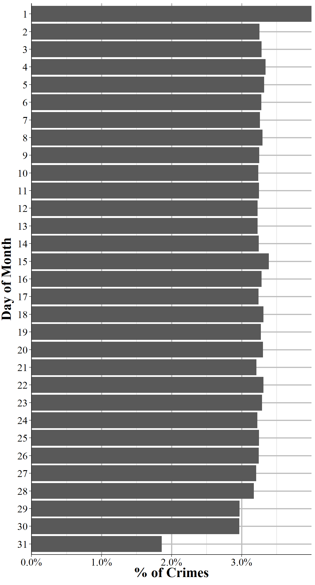
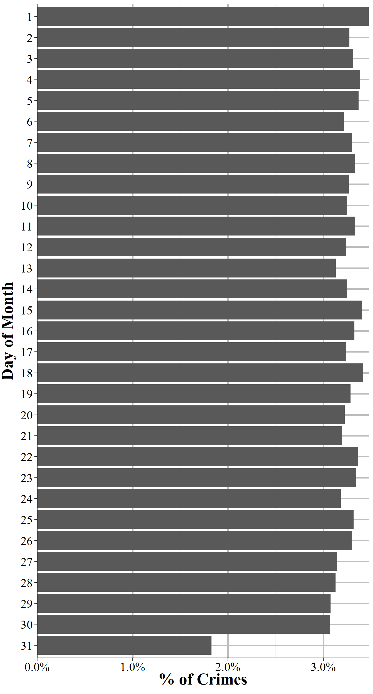
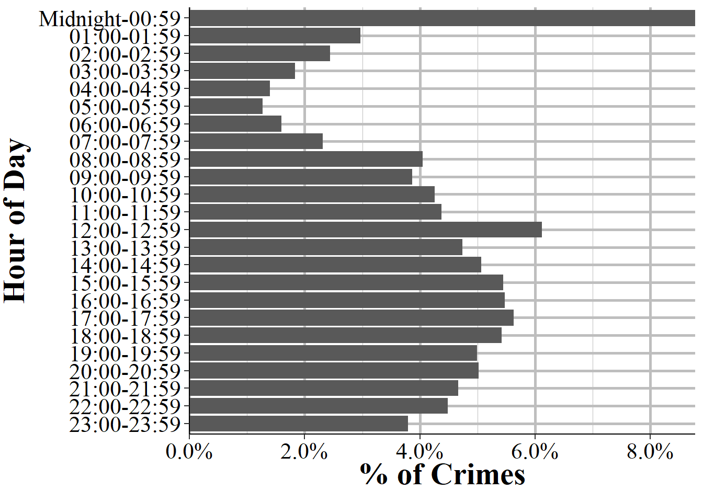
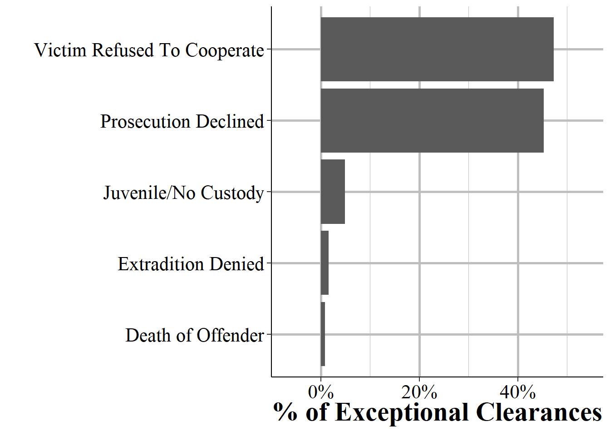
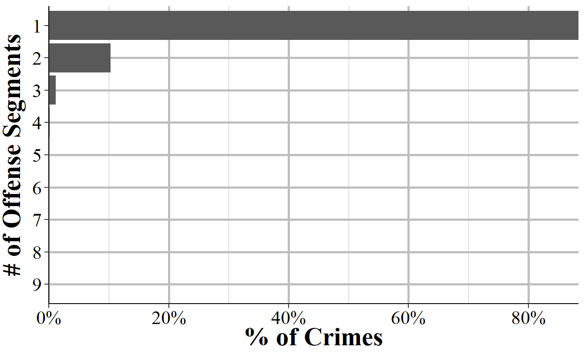
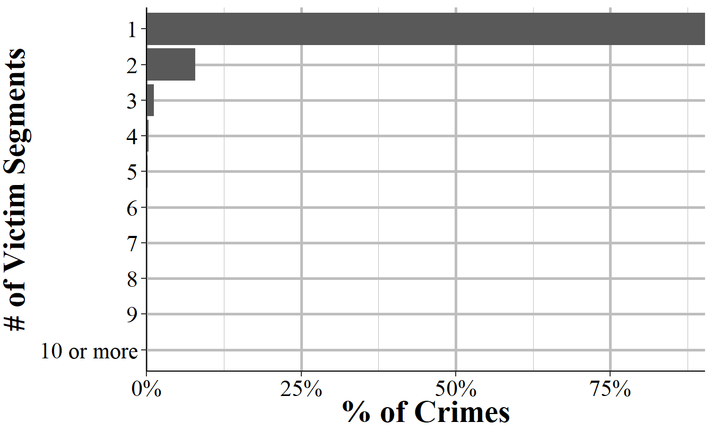
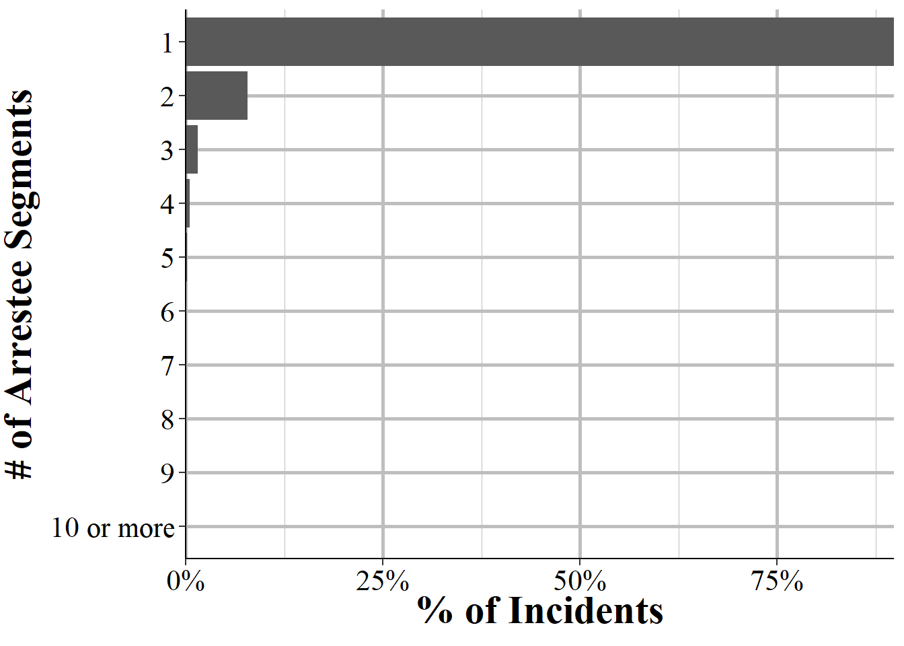
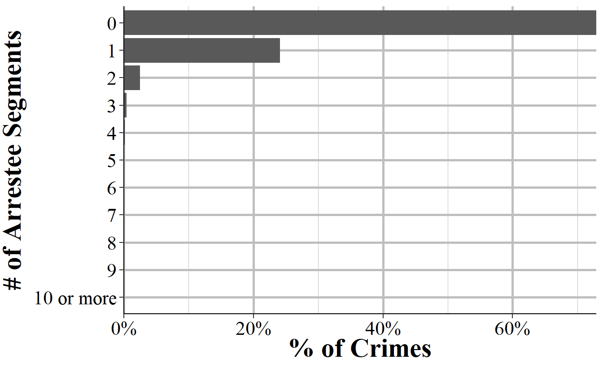

# Administrative and Window Exceptional Clearance Segment 

The Administrative Segment provides information about the incident itself, such as how many victims or offenders there were. In practice this means that it tells us how many other segments - offense, victim, offender, and arrestee segments - there are for this particular incident. It also has several important variables at the incident-level such as what hour of the day the incident occurred and whether the incident date variable is actually just the date the incident was reported. Finally, it tells us whether the case was cleared exceptionally and, if so, what type of exceptional clearance it was. This can tell us, for example, how many crimes was cleared because the offender died or the victim refused to cooperate. As the UCR data doesn't differentiate between normal clearances (i.e. arrest the offender) and exceptional clearances, this provides a far deeper understanding of case outcomes. 

## Important variables

### The incident report date

(\#fig:administrativeMonthDay)The percent of crimes that occur (the day of the incident, even if the crime wasn't reported that day) each day of the month for all agencies reporting to NIBRS in 2019.

(\#fig:administrativeMonthDayReport)The percent of crimes that are reported (the day of the report, even if not the day of the incident) each day of the month for all agencies reporting to NIBRS in 2019.

### Hour of incident

An extremely important aspect of crime data is when exactly the crime occurs. If, for example, crime always spikes when the local high school ends their day that would likely indicate that high school students are involved with crime (both as victims-offenders). In my own research on daylight saving time-crime I only care about the sunset hours, which is when daylight saving time would affect outdoor lighting. When crime happens also would affect police behavior as they'd likely increase patrol during times of elevated crime. Luckily NIBRS data does have the time of each incident, though it's only at the hour level.

(\#fig:administrativeHours)The percent of crimes that are reported each hour for all agencies reporting to NIBRS in 2019.

### Exceptional clearance

(\#fig:administrativeExceptionalClearances)The percent of crimes that are reported each hour for all agencies reporting to NIBRS in 2019.

### Number of other segments

#### Offense segments

(\#fig:administrativeOffenseSegments)The percent of crimes that are reported each day of the month for all agencies reporting to NIBRS in 2019.

#### Victim segments

(\#fig:administrativeVictimSegments)The percent of crimes that are reported each day of the month for all agencies reporting to NIBRS in 2019.

#### Offender segments

(\#fig:administrativeOffenderSegments)The percent of crimes that are reported each day of the month for all agencies reporting to NIBRS in 2019.

#### Arrestee segments

(\#fig:administrativeArresteeSegments)The percent of crimes that are reported each day of the month for all agencies reporting to NIBRS in 2019.

