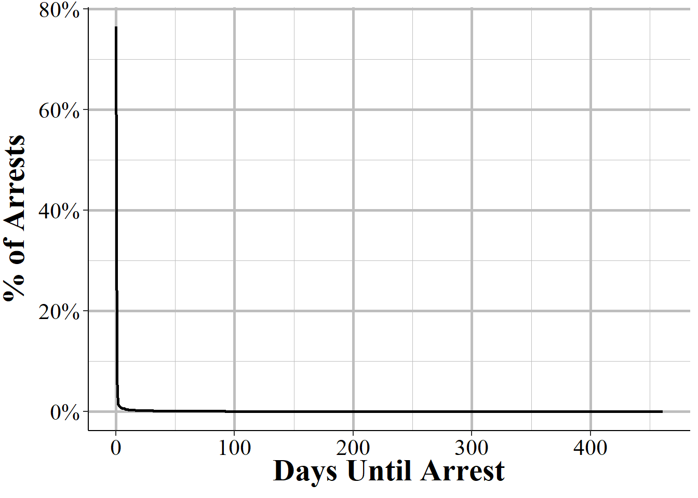

# Arrestee, Group B Arrestee, and Window Arrestee Segment 


## Important variables

### Crime arrested for (excluding Group B arrests)

<div class="figure" style="text-align: center">

```{=html}
<div id="htmlwidget-844b88a66fb40ff89df2" style="width:100%;height:auto;" class="datatables html-widget"></div>
<script type="application/json" data-for="htmlwidget-844b88a66fb40ff89df2">{"x":{"filter":"none","data":[["1","2","3","4","5","6","7","8","9","10","11","12","13","14","15","16","17","18","19","20","21","22","23","24","25","26","27","28","29","30","31","32","33","34","35","36","37","38","39","40","41","42","43","44","45","46","47","48","49","50","51","52","53","54","55","56","57","58","59","60","61","62"],["Drug/Narcotic Violations","Simple Assault","Shoplifting","Aggravated Assault","All Other Larceny","Drug Equipment Violations","Destruction/Damage/Vandalism of Property","Burglary/Breaking And Entering","Intimidation","Weapon Law Violations","All Other Offenses","Stolen Property Offenses (Receiving, Selling, Etc.)","Motor Vehicle Theft","Robbery","False Pretenses/Swindle/Confidence Game","Theft From Motor Vehicle","Counterfeiting/Forgery","Theft From Building","Disorderly Conduct","Driving Under The Influence","Impersonation","Kidnapping/Abduction","Credit Card/Atm Fraud","Fondling (Incident Liberties/Child Molest)","Trespass of Real Property","Rape","Embezzlement","Prostitution","Murder/Nonnegligent Manslaughter","Liquor Law Violations","Identity Theft","Drunkenness","Pocket-Picking","Pornography/Obscene Material","Arson","Family Offenses, Nonviolent","Theft of Motor Vehicle Parts/Accessories","Animal Cruelty","Assisting Or Promoting Prostitution","Sodomy","Statutory Rape","Purse-Snatching","Curfew/Loitering/Vagrancy Violations","Sexual Assault With An Object","Purchasing Prostitution","Theft From Coin-Operated Machine Or Device","Negligent Manslaughter","Operating/Promoting/Assisting Gambling","Betting/Wagering","Extortion/Blackmail","Welfare Fraud","Human Trafficking - Commercial Sex Acts","Bribery","Bad Checks","Wire Fraud","Incest","Runaway","Gambling Equipment Violations","Hacking/Computer Invasion","Peeping Tom","Human Trafficking - Involuntary Servitude","Sports Tampering"],[523732,385695,228355,127192,104244,95730,69153,56613,52972,51907,49288,32953,28489,25590,23183,18780,18022,15899,11413,10084,9429,8941,6846,6659,6439,6406,6327,5492,4788,4267,3802,3753,3137,3055,3016,2498,2026,1852,1442,1374,1137,866,840,647,609,426,327,262,262,254,241,232,230,210,180,150,90,89,66,39,27,1],[0.258246927557213,0.19018228545168,0.112599530184001,0.0627170828016181,0.0514016571763309,0.0472034902871164,0.0340986416361115,0.0279152950550979,0.0261199549513123,0.0255948142727812,0.0243034119844499,0.0162487894644453,0.0140476364231658,0.0126181689799155,0.0114313017374514,0.00926022717635062,0.00888646507839142,0.00783963535020227,0.00562763433246484,0.00497231793643875,0.00464934409189617,0.00440871625046597,0.00337569303776871,0.0032834852378764,0.00317500547329721,0.00315873350861033,0.00311977941132963,0.00270804939576771,0.00236091414911431,0.00210401434299724,0.00187472756786395,0.00185056616575314,0.00154682282493141,0.00150638945813371,0.00148715895441286,0.00123173841781277,0.000999000013806515,0.000913202381821158,0.000711035547832673,0.000677505438780924,0.0005606431469388,0.000427015800570801,0.000414195464756897,0.00031902912583061,0.00030029171194875,0.000210056271412426,0.000161240377351792,0.000129189537817032,0.000129189537817032,0.000125244819105062,0.00011883465119811,0.000114396842647143,0.00011341066296915,0.000103548866189224,8.8756171019335e-05,7.39634758494459e-05,4.43780855096675e-05,4.38849956706712e-05,3.25439293737562e-05,1.92305037208559e-05,1.33134256529003e-05,4.93089838996306e-07]],"container":"<table class=\"display\">\n  <thead>\n    <tr>\n      <th> <\/th>\n      <th>Crime Category<\/th>\n      <th># of Offenses<\/th>\n      <th>% of Offenses<\/th>\n    <\/tr>\n  <\/thead>\n<\/table>","options":{"pageLength":100,"columnDefs":[{"targets":2,"render":"function(data, type, row, meta) {\n    return type !== 'display' ? data : DTWidget.formatRound(data, 0, 3, \",\", \".\");\n  }"},{"targets":3,"render":"function(data, type, row, meta) {\n    return type !== 'display' ? data : DTWidget.formatPercentage(data, 2, 3, \",\", \".\");\n  }"},{"className":"dt-right","targets":[2,3]},{"orderable":false,"targets":0}],"order":[],"autoWidth":false,"orderClasses":false}},"evals":["options.columnDefs.0.render","options.columnDefs.1.render"],"jsHooks":[]}</script>
```

<p class="caption">(\#fig:arresteeCrime)The number and percent of crimes reported from all agencies in 2019, by crime category.</p>
</div>

### Group B Crimes arrested for

<div class="figure" style="text-align: center">

```{=html}
<div id="htmlwidget-4e3edf4df990b7d739f5" style="width:100%;height:auto;" class="datatables html-widget"></div>
<script type="application/json" data-for="htmlwidget-4e3edf4df990b7d739f5">{"x":{"filter":"none","data":[["1","2","3","4","5","6","7","8","9","10","11"],["All Other Offenses","Driving Under The Influence","Disorderly Conduct","Drunkenness","Trespass of Real Property","Liquor Law Violations","Family Offenses, Nonviolent","Runaway","Curfew/Loitering/Vagrancy Violations","Bad Checks","Peeping Tom"],[1095755,351926,117707,116343,108546,68862,31251,9535,9360,3911,414],[0.572611451654203,0.183906856674035,0.0615104436118122,0.0607976546945302,0.0567231567560788,0.0359853888723408,0.0163309138225657,0.00498272897821395,0.0048912787872137,0.00204378112572572,0.000216345023280606]],"container":"<table class=\"display\">\n  <thead>\n    <tr>\n      <th> <\/th>\n      <th>Crime Category<\/th>\n      <th># of Offenses<\/th>\n      <th>% of Offenses<\/th>\n    <\/tr>\n  <\/thead>\n<\/table>","options":{"pageLength":100,"columnDefs":[{"targets":2,"render":"function(data, type, row, meta) {\n    return type !== 'display' ? data : DTWidget.formatRound(data, 0, 3, \",\", \".\");\n  }"},{"targets":3,"render":"function(data, type, row, meta) {\n    return type !== 'display' ? data : DTWidget.formatPercentage(data, 2, 3, \",\", \".\");\n  }"},{"className":"dt-right","targets":[2,3]},{"orderable":false,"targets":0}],"order":[],"autoWidth":false,"orderClasses":false}},"evals":["options.columnDefs.0.render","options.columnDefs.1.render"],"jsHooks":[]}</script>
```

<p class="caption">(\#fig:GrouBarresteeCrime)The number and percent of crimes reported from all agencies in 2019, by crime category.</p>
</div>

### Arrest date




### Weapons

All crimes can potentially have a weapon

<div class="figure" style="text-align: center">

<p class="caption">(\#fig:arresteeWeapon)The bias motivation (i.e. if hate crime or not) for all arrestees reported in 2019.</p>
</div>

<div class="figure" style="text-align: center">

<p class="caption">(\#fig:arresteeWeaponArmed)The bias motivation (i.e. if hate crime or not) for all arrestees reported in 2019.</p>
</div>


### Automatic weapons

This variable only tells you if the weapon is automatic 


### Type of arrest


### Disposition for juvenile arrestees


### Residence status


### Demographics

#### Age


#### Sex


#### Race


#### Ethnicity


