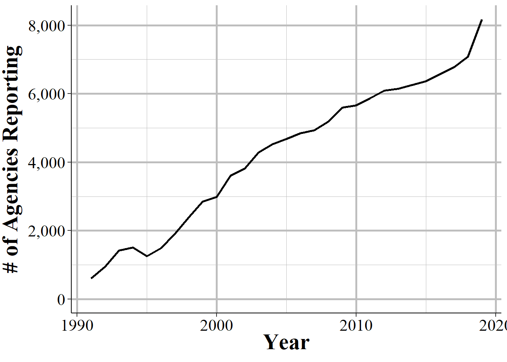
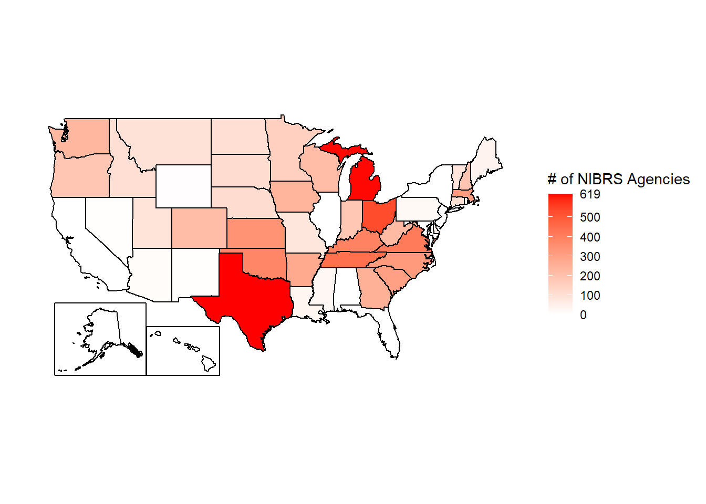

# Overview of the Data


Nearly a century ago the FBI started collecting data on crime that occurred in the United States as a way to better understand and respond to crime. This data, the Uniform Crime Reporting (UCR) Program Data, is a monthly count of the number of crime incidents (in cases where more than one crime happens per incident, only the most serious crime is included) in each police agency that reports data.^[This data has been expanded since it began in 1929 to include information on arrests, hate crimes, and stolen property. For more on this, please see my book Uniform Crime Reporting (UCR) Program Data: A Practitioner’s Guide at ucrbook.com.] Other than for homicides, only the number of crimes that occurred is included. So we know, for example, the number of robberies in a city but nothing about who the victims or offenders were, when that month (day or time of day) the robberies occurred, or the type of location where they happened. To address these limitations the FBI started a new dataset in 1991, the National Incident-Based Reporting System data, which is known by its abbreviation NIBRS, and is the topic of this book.

NIBRS data provides detailed information on every crime reported to the police, including victim and offender demographics, whether the offender was arrested (and type of arrest or type of "exceptional clearance"), the crime date and hour, victim-offender relationship, and the crime location (as a location type, not the exact address). It also covers a far wider range of crimes than UCR data did. With the exception of UCR data on assaults against police officers, all NIBRS data can be converted back to UCR data, making it fully backwards compatible - and, therefore, comparable to UCR data. In many ways NIBRS data is a massive improvement to UCR data. We now have a far deeper understanding of crime and this has led to an explosion of research that allows a far more detailed analysis of crime and crime-policies than the blunt UCR data. 

However, this is a major limitation to this data: most agencies don't use it. [According to the FBI](https://www.fbi.gov/news/pressrel/press-releases/fbi-releases-2019-nibrs-crime-data) only about 8,500 police agencies, covering about 45% of the US population, reported NIBRS data in 2019 (the latest year currently available), fewer than half of the about 18,000 police agenices in the United States. This is an even larger problem that it seems are the agencies that do report - especially in earlier years of the data - are disproportionately small and rural. So we're missing out of data from major cities. A number of states don't have any agencies reporting, making this data relatively biased at least in terms of geography and city size. **Even so, the FBI has said that they are moving entirely to NIBRS data starting in 2021, and will no longer even collect UCR data.** While NIBRS can be converted to UCR data, meaning we can have consistent statistics over time, for agencies that don't report to NIBRS, we have no information on their crimes. In effect, unless the majority of agencies suddenly switch to NIBRS - which, given the high level of detail relative to UCR data is a costly and timely switch - we will be flying blind for most crime in the country. 

So there are really three major problems with NIBRS data, both related to the lack of reporting. First, we are potentially looking at a massive loss of data when UCR data ends in 2020 - it takes over a year for data to be released so even though I'm writing this is Spring 2021, 2019 UCR and NIBRS data are the latest years available. Especially given the huge crime changes during 2020 - and whose violent crime increases and continuing into 2021 - losing standardized crime data for most cities is a very bad thing. The second problem is that even if suddenly all agencies do start reporting in 2021, we'd only have a single year of data available. Even for agencies that already report, we generally don't have too many years of data for them. This really limits the kind of research since we can do since it's hard to know if a finding is based on a trend or is just a weird outlier without having many years of data available. This means that for the next several years at least we'll be mostly using NIBRS data as UCR-like datasets, aggregated to the month- or year-level so we can compare it with UCR data from the past. Luckily, this problem will be alleviated the longer we wait as more years of data will become available. 

The final issue is that this data is massive. A single year of 2019 data, with <50% of agencies reporting, and few large agencies, reporting has about 6.5 million crime incidents recorded. Since each crime incident can have multiple victims, offenders, and crimes, there are more rows for these datasets. Once all agencies report - though it's doubtful that'll ever occur - we're looking at tens of millions of rows per year. And even now if we wanted to look at a decade of data we're going to be dealing with over 50 million rows of data. So this data requires both good hardware - a strong laptop or server is necessary - and good programming skills, which most academics sorely lack. If you can, buy more RAM for your computer as that's much easier than having to write complicated code to deal with large data.^["When in doubt, apply force" - Dean Knox.]

While people generally refer to NIBRS just as "NIBRS data" it is actually a collection multiple different datasets all - with a few exceptions - corresponding to a single crime incident. For example, if you care about victim info you'll look in the victim file called the "Victim Segment" (each of the datasets are called "Segments" since they are part of the whole picture of the crime incident) and likely will merge it with other data, such as when are where the crime occurred which is in the "Offense Segment". In most cases you'll merge together multiple datasets from the NIBRS collection to be able to answer the question that you have. This means that you'll need to understand how to deal with multiple datasets, and subset and merge them as needed.

Relative to the FBI's UCR data there are far fewer "weird things" in NIBRS data. Still, we'll cover instances of the "weirdness" in the data, such as the why crime always goes up on the 1st of the month, or why there are more crimes at noon than at nearly all other hours of the day. We'll also be discussing how much of the detailed information that should be available in the data is missing, and when that affects which questions we can answer.

A word of caution. To date fewer than half of agencies report NIBRS data. As they rush to comply with the FBI's order that they only will accept NIBRS data, there will likely be more mistakes made and erroneous data included in NIBRS data later than is covered in this book, which ends with 2019 data as 2019 is the most recent year available. So while I always urge caution when using any data - caution that should be accompanied by a thorough examination of your data before using it - NIBRS data from 2020 and beyond merits extra attention.

### Choosing a unit of analysis

A major benefit of UCR data is that you have very limited choices. If you wanted to measure crime you only choice was to use their monthly aggregated city-level data. This makes working with the data relatively easy, even though what work you could do was limited. NIBRS data takes an opposite approach. It provides detailed data and largely leaves it up to the users for what to do with it. This flexibility is also a curse. For every use of this data you will need to decide which unit of analysis to use - and NIBRS provides a few options.

Consider, for example, that you want to measure rape in a city. Even if we somehow solve the issue of victims not reporting their rapes, we still have a few different ways of even measuring rape. Let's use an incident where four men rape a single woman as an example. If you're interested in measuring robbery you could do so in several different ways, each of which addresses a different part of crime measurement and will lead to different answers to your questions: the number of crime incidents, the number of victims, the number of offenders, and the number of crimes. First, we can follow the old UCR measure of incident-level and say that this is one rape since only one crime incident occurred (even though there were multiple offenders). Second, we could look at the victim-level, which again is one rape as there was only one victim. Or at the offender-level, which now has four rapes since each offender would be responsible the robbery. Finally we could look at the offense-level. This data actually makes it unclear what act each offender actually committed so we'd likely measure it as one offense per offender in each incident.^[For four people involved in a rape, do we care if all four actually committed the crime? Does it matter if only three committed the rape and one merely stood by?]

## Crimes included in NIBRS

### Group A crimes

* __Aggravated Assault__                                 
* __All Other Larceny__                                  
* Animal Cruelty                                     
* Arson                                              
* Assisting Or Promoting Prostitution                
* Betting/Wagering                                   
* Bribery                                            
* __Burglary/Breaking And Entering__                     
* Counterfeiting/Forgery                             
* Credit Card/ATM Fraud                              
* Destruction/Damage/Vandalism of Property           
* Drug Equipment Violations                          
* Drug/Narcotic Violations                           
* Embezzlement                                       
* Extortion/Blackmail                                
* False Pretenses/Swindle/Confidence Game            
* Fondling (Incident Liberties/Child Molest)         
* Gambling Equipment Violations                      
* Hacking/Computer Invasion                          
* Human Trafficking - Commercial Sex Acts            
* Human Trafficking - Involuntary Servitude          
* Identity Theft                                     
* Impersonation                                      
* Incest                                             
* Intimidation                                       
* Justifiable Homicide                               
* Kidnapping/Abduction                               
* __Motor Vehicle Theft__                                
* __Murder/Non-negligent Manslaughter__                   
* __Negligent Manslaughter__                             
* Operating/Promoting/Assisting Gambling             
* Pocket-Picking                                     
* Pornography/Obscene Material                       
* Prostitution                                       
* Purchasing Prostitution                            
* __Purse-Snatching__                                    
* __Rape__                                               
* __Robbery__                                            
* __Sexual Assault With An Object__                      
* __Shoplifting__                                        
* __Simple Assault__                                     
* __Sodomy__                                             
* Sports Tampering                                   
* Statutory Rape                                     
* Stolen Property Offenses (Receiving, Selling, Etc.)
* __Theft From Building__                                
* __Theft From Coin-Operated Machine Or Device__         
* __Theft From Motor Vehicle__                           
* __Theft of Motor Vehicle Parts/Accessories__           
* Weapon Law Violations                              
* Welfare Fraud                                      
* Wire Fraud 

### Group B crimes

* All Other Offenses
* Bad Checks                          
* Curfew/Loitering/Vagrancy Violations
* Disorderly Conduct                  
* Driving Under The Influence
* Drunkenness                         
* Family Offenses, Nonviolent
* Liquor Law Violations               
* Peeping Tom
* Runaway                             
* Trespass of Real Property


## Differences from UCR data

### NIBRS does not have unfounded crimes

In UCR data, which provides monthly counts of crimes (as well as more detailed info on hate crimes and homicides, and monthly counts of arrests), there is a count of "unfounded" crimes in each month. An unfounded crime is just one which was previously reported and then new evidence finds out that it never actually occurred (or that it isn't for the crime that was reported). For example, if you misplace your wallet but think it is stolen you may call the police and report it stolen. This would be recorded in UCR data as a theft. If you then find your wallet and tell the police, then it would be changed to an unfounded crime since the reported theft never actually happened. NIBRS data does not include unfounded data at all so you don't know how many reported crimes turn out to not be true. In practice, this doesn't matter too much as unfounded crimes are very, constituting generally under 2% of each crime type. The major exception is in rape, where some agencies report that over 10% of rapes in certain years are unfounded. For more on this issue with rape, please see this section of my UCR book [here](https://ucrbook.com/offensesKnown.html#unfounded-crimes). 
 Given that UCR data already has major issue with rape data, including both changes in the definition of rape in 2013 and evidence that the number of cleared rapes is greatly exaggerated (see [here](https://www.propublica.org/article/when-it-comes-to-rape-just-because-a-case-is-cleared-does-not-mean-solved) for more info on this), losing unfounded rapes means losing a not insignificant number of likely real rapes. 

Unfounded crimes are also a way that the UCR used to identify justifiable homicides and when police killed someone. But that way was not always used properly and NIBRS data already includes justifiable homicide as a crime category so this isn't a problem.

#### NIBRS does not have negative numbers

Negative numbers in UCR data are because when a crime is reported and then later unfounded, in the month that it is unfounded it is classified as -1 crimes. This is so over the long term (i.e. more than a single month) the positive (but incorrect, and therefore unfounded) reports and the negative reports to deal with unfounding would equal out so you have the actual number of crimes. In practice though this tended to end up confusing users - though only users who didn't read the manual. Since NIBRS does not have unfounded data, and since it isn't aggregated beyond the incident-level anyways, there are no negative numbers in NIBRS data.

### Less information on assaults against officers

## A summary of each segment file

<div class="figure" style="text-align: center">

<p class="caption">(\#fig:segmentFlowchart)The association of each segment file in the NIBRS dataset.</p>
</div>

### Administrative Segment

### Offense Segment

### Offender Segment

### Victim Segment

### Arrestee and Group B Arrestee Segment

### Property Segment

### Window segments


## Which agencies report data

So if this data has the same info (other than unfounded and negative crimes) as UCR data, but is also far more detailed, why do people ever use UCR data? Besides NIBRS being more complicated to use, far fewer agencies report NIBRS data than do UCR data. Nearly all agencies report crime data for UCR, though fewer do so for some of the UCR datasets such as arrests or arsons - for more, please see my [UCR book](https://ucrbook.com/). In comparison, fewer than half of agencies report to NIBRS, and these agencies are disproportionately smaller and more rural. Starting with 2021 data, the FBI has stopped collecting UCR data, instead only collecting NIBRS data. So if - and this is a very large if - agencies move to NIBRS in 2021, we'll start having much more detail from a very representative sample of agencies.^[I say representative sample as certainly not all agencies will report, even once UCR is no longer collected. It'll take time for all agencies to report, and I doubt we'll ever get to 100% of agencies.]. Even so, most research - especially policy analyses - requires many years of data so it'll take many years before the full potential of NIBRS data can be realized, assuming most agencies report data starting in 2021.

We'll look here at how many agencies report at least one crime between 1991 - the first year of data - and 2019 - the latest year of data - as well as compare NIBRS reporting to UCR reporting. Figure \@ref(fig:agenciesReporting) shows the number of agencies each year that reported at least one incident. Keep in mind that there are about 18,000 police agencies in the United States. Only a little over 600 agencies reporting in 1991. This has grown pretty linearly, adding a few hundred agencies each year though that trend accelerated in recent years. In 2019, nearly 8,200 agencies reported at least some data to NIBRS. Compared to the estimated 18,000 police agencies in the united States, however, this is  This is an overcount, however, this constitutes relatively low participation among agencies. And, as agencies may report for part of the year meaning that we actually have fewer fully reporting agencies that this graph applies.


<div class="figure" style="text-align: center">

<p class="caption">(\#fig:agenciesReporting)The annual number of agencies reporting at least one incident in that year.</p>
</div>

Another way to look at reporting is comparing it to reporting to UCR. Figure \@ref(fig:agenciesReportingMap) shows the number of agencies in each state that report NIBRS data in 2019. Since 2019 is the year with the most participation, this does overstate reporting for previous years. This map pretty closely follows a population map of the US. Texas had the most agencies, followed by Michigan and Ohio. The southern states have more agencies reporting than the lightly populated northern states. The issue here is that a number of states are in white, indicating that very few agencies reported. Indeed, four four of the most populated states - California, New York, Florida, and New Jersey - don't have any agencies at all that report NIBRS data.

<div class="figure" style="text-align: center">

<p class="caption">(\#fig:agenciesReportingMap)The number of agencies in each state that reported at least one crime in 2019 to NIBRS.</p>
</div>

Since the number of agencies in a state is partially just a factor of population, Figure \@ref(fig:agenciesReportingMapPercent) shows each state as a percent of agencies in that state that report to NIBRS that also reported to the UCR Offenses Known and Clearances by Arrest (the "crime" dataset) in 2019. Not all agencies in the US reported to UCR in 2019 -  and a small number reported to NIBRS but not UCR in 2019 - but this is a fairly good measure of reporting rates. Here the story looks a bit different than in the previous figure. Now we can tell that among north-western states and states along the Appalachian  mountains, nearly all agencies report. In total, 18 states have 90% or more of agencies that reported to UCR in 2019 also reporting to NIBRS. Thirteen agencies have fewer than 10% of agencies reporting to NIBRS that also reported to UCR, with 5 of these having 0% of agencies reporting. The remaining states average about 56% of agencies reporting. So when using NIBRS data, keep in mind that you have very good coverage of certain states, and very poor coverage of other states. And the low - or no - reporting states are systematically high population states.    

<div class="figure" style="text-align: center">

<p class="caption">(\#fig:agenciesReportingMapPercent)Agencies in each state reporting at least one crime to NIBRS in 2019 as a percent of agencies that reported UCR Offenses Known and Clearances by Arrests data in 2019.</p>
</div>

For ease of reference, Table \@ref(fig:agenciesReportingTable) shows the number of agencies in each state reporting to NIBRS and to UCR in 2019, and the percent shown in Figure \@ref(fig:agenciesReportingMapPercent). If you're reading this on your phone or computer you can search or sort the table.

<div class="figure" style="text-align: center">

```{=html}
<div id="htmlwidget-2d8f8e0a38e9d69400b7" style="width:100%;height:auto;" class="datatables html-widget"></div>
<script type="application/json" data-for="htmlwidget-2d8f8e0a38e9d69400b7">{"x":{"filter":"none","data":[["1","2","3","4","5","6","7","8","9","10","11","12","13","14","15","16","17","18","19","20","21","22","23","24","25","26","27","28","29","30","31","32","33","34","35","36","37","38","39","40","41","42","43","44","45","46","47","48","49","50","51"],["Alabama","Alaska","Arizona","Arkansas","California","Colorado","Connecticut","Delaware","District of Columbia","Florida","Georgia","Hawaii","Idaho","Illinois","Indiana","Iowa","Kansas","Kentucky","Louisiana","Maine","Maryland","Massachusetts","Michigan","Minnesota","Mississippi","Missouri","Montana","Nebraska","Nevada","New Hampshire","New Jersey","New Mexico","New York","North Carolina","North Dakota","Ohio","Oklahoma","Oregon","Pennsylvania","Rhode Island","South Carolina","South Dakota","Tennessee","Texas","Utah","Vermont","Virginia","Washington","West Virginia","Wisconsin","Wyoming"],[1,0,11,277,0,217,100,60,1,0,251,1,104,1,180,240,343,389,30,39,2,317,616,153,26,80,95,113,4,187,0,4,0,320,106,529,381,184,21,47,306,115,443,619,88,86,411,231,221,215,5],[352,33,114,278,738,222,107,63,3,678,522,3,108,739,289,246,376,413,188,135,156,363,650,409,79,576,103,236,62,188,578,121,572,333,110,604,437,208,1477,49,405,129,465,1053,129,89,415,257,240,428,55],[0.00284090909090909,0,0.0964912280701754,0.996402877697842,0,0.977477477477477,0.934579439252337,0.952380952380952,0.333333333333333,0,0.480842911877395,0.333333333333333,0.962962962962963,0.0013531799729364,0.622837370242215,0.975609756097561,0.912234042553192,0.941888619854721,0.159574468085106,0.288888888888889,0.0128205128205128,0.8732782369146,0.947692307692308,0.374083129584352,0.329113924050633,0.138888888888889,0.922330097087379,0.478813559322034,0.0645161290322581,0.99468085106383,0,0.0330578512396694,0,0.960960960960961,0.963636363636364,0.875827814569536,0.871853546910755,0.884615384615385,0.014218009478673,0.959183673469388,0.755555555555556,0.891472868217054,0.952688172043011,0.587844254510921,0.682170542635659,0.966292134831461,0.990361445783133,0.898832684824903,0.920833333333333,0.502336448598131,0.0909090909090909]],"container":"<table class=\"display\">\n  <thead>\n    <tr>\n      <th> <\/th>\n      <th>State<\/th>\n      <th>NIBRS Agencies<\/th>\n      <th>UCR Agencies<\/th>\n      <th>% of UCR Agencies<\/th>\n    <\/tr>\n  <\/thead>\n<\/table>","options":{"pageLength":100,"columnDefs":[{"targets":4,"render":"function(data, type, row, meta) {\n    return type !== 'display' ? data : DTWidget.formatPercentage(data, 2, 3, \",\", \".\");\n  }"},{"className":"dt-right","targets":[2,3,4]},{"orderable":false,"targets":0}],"order":[],"autoWidth":false,"orderClasses":false,"rowCallback":"function(row, data, displayNum, displayIndex, dataIndex) {\nvar value=data[1]; $(this.api().cell(row, 1).node()).css({'text-align':'left'});\n}"}},"evals":["options.columnDefs.0.render","options.rowCallback"],"jsHooks":[]}</script>
```

<p class="caption">(\#fig:agenciesReportingTable)The number of agencies in each state reporting to NIBRS and to UCR in 2019. Also shows NIBRS reporting in each state as a percent of UCR reporting.</p>
</div>


## How to identify a particular agency (ORI codes)

In the UCR and other FBI data sets, agencies are identified using **OR**iginating Agency **I**dentifiers or an ORI. An ORI is a unique ID code used to identify an agency.^[I will refer to this an "ORI", "ORI code", and "ORI number", all of which mean the same thing.] If we used the agency's name we'd end up with some duplicates since there can be multiple agencies in the country (and in a state, those this is very rare) with the same name. For example, if you looked for the Philadelphia Police Department using the agency name, you'd find both the "Philadelphia Police Department" in Pennsylvania and the one in Mississippi. Each ORI is a 9-digit value starting with the state abbreviation (for some reason the FBI incorrectly puts the abbreviation for Nebraska as NB instead of NE) followed by 7 numbers. In the UCR data (another FBI data set) the ORI uses only a 7-digit code - with only the 5 numbers following the state abbreviation instead of 7. So the NIBRS ORI codes are sometimes called ORI9. For nearly all agencies, the only difference between the UCR ORI and the NIBRS ORI is that the NIBRS ORI has "00" at the end so it is technically 9 characters long but isn't any more specific than the 7-character UCR ORI code. 

When dealing with specific agencies, make sure to use the ORI rather than the agency name to avoid any mistakes. For an easy way to find the ORI number of an agency, use [this page](https://jacobdkaplan.com/crosswalk.html) on my site. Type an agency name or an ORI code into the search section and it will return everything that is a match.

## The data as you get it from the FBI

We'll finish this overview of the NIBRS data by briefly talking about format of the data that is released by the FBI, before the processing done by myself or [NACJD](https://www.icpsr.umich.edu/web/pages/NACJD/index.html) that converts the data to a type that software like R or Stata or Excel can understand. The FBI releases their data as fixed-width ASCII files which are basically just an Excel file but with all of the columns squished together. As an example, Figure \@ref(fig:ascii) shows what the data looks like as you receive it from the FBI for the 1991 NIBRS data, the first year with data available. The way the FBI releases NIBRS data adds even more complications to using ASCII files. Since there are multiple segments in each NIBRS file you'd think that each segment would be its own file. But, no, the FBI gives you a single file with every segment stacked on top of each other. And, it's "stacked" essentially in a random way where row 1 may be from a certain segment while the next row is from a different segment. 

You can think of this a little like chapters from a book. Normally chapter 1 is first, followed by chapter 2 and so on. And within each chapter are sentences that use proper punctuation so we can easily read it and know where one sentence ends and the next begins. The FBI's NIBRS data basically removes all punctuation, cuts up every sentence and rearranges them in a random order and then hands it to you and says "read this." This is a terrible way to present any data, but is what we've had every since data began in 1991 and seems highly unlikely to change.

The "fixed-width" part of the file type is how this works (the ASCII part basically means it's a text file). Each row is the same width - literally the same number of characters, including blank spaces. Though each segment has a different width so you'll first need to grab only the rows that correspond to a particular segment before you can read in that segment. So you must tell the software you are using to process this file - by literally writing code in something called a "setup file" but is basically just instructions for whatever software you use (R, SPSS, Stata, SAS can all do this) - which characters are certain columns. For example, in this data the first two character says which segment it is (07 means the Group B Arrestee segment) and the next two characters (in the setup file written as 3-4 since it is characters 3 through 4 [inclusive]) are the state number (01 is the state code for Alabama).^[We can see several rows down that we have a row starting with "01" which means it is an Administrative segment, and then starting with "02" which is from the Offense segment.] So we can read this row as the first column indicating it is an Group B Arrestee segment, the second column indicating that it is for the state of Alabama, and so on for each of the remaining columns. To read in this data you'll need a setup file that covers every column in the data (some software, like R, can handle just reading in the specific columns you want and don't need to include every column in the setup file).

<div class="figure" style="text-align: center">

<p class="caption">(\#fig:ascii)Fixed-width ASCII file for the 1991 National Incident-Based Reporting System (NIBRS) dataset.</p>
</div>

The second important thing to know about reading in a fixed-width ASCII file is something called a "value label."^[For most fixed-width ASCII files there are also missing values where it'll have placeholder value such as -8 and the setup file will instruct the software to convert that to NA. UCR data, however, does not have this and does not indicate when values are missing in this manner.] For example, in the above image we saw the characters 3-4 is the state and in the row we have the value "01" which means that the state is "Alabama." Since this type of data is trying to be as small as efficient as possible, it often replaces longer values with shorter one and provides a translation for the software to use to convert it to the proper value when reading it. "Alabama" is more characters than "01" so it saves space to say "01" and just replace that with "Alabama" later on. So "01" would be the "value" and "Alabama" would be the "label" that it changes to once read. 

Fixed-width ASCII files may seem awful to you reading it today, and it is awful to use. But it appears to be an efficient way to store data back many decades ago when data releases began but now is extremely inefficient - in terms of speed, file size, ease of use - compared to modern software so I'm not sure why they *still* release data in this format. For you, however, the important part to understand is not how exactly to read this type of data, but to understand that people who made this data publicly available (such as myself and the team at NACJD) must make this conversion process.^[For those interested in reading in this type of data, please see my R package asciiSetupReader.] **This conversion process, from fixed-width ASCII to a useful format is the most dangerous step taken in using this data - and one that is nearly entirely unseen by researchers.** 

Every line of code you write (or, for SPSS users, click you make) invites the possibility of making a mistake.^[Even highly experienced programmers who are doing something like can make mistakes. For example, if you type out "2+2" 100 times - something extremely simple that anyone can do - how often will you mistype a character and get a wrong result? I'd guess that at least once you'd make a mistake.] The FBI does not provide a setup file with the fixed-width ASCII data so to read in this data you need to make it yourself.^[They do provide the instructions in a PDF but you still need to actually make the file yourself. You cannot use their instructions.] Each NIBRS segment has over a dozen columns and potentially dozens on value labels.^[In comparison to UCR data, this is far less complicated to make a setup file for, so the risk of mistakes is far lower.] A typo anywhere could have potentially far-reaching consequences, so this is a crucial weak point in the data cleaning process - and one in which I have not seen anything written about before.^[Other than in my own UCR book.] While I have been diligent in checking the setup files and my code to seek out any issues - and I know that NACJD has a robust checking process for their own work - that doesn't mean our work is perfect.^[For evidence of this, please see any of the openICPSR pages for my detail as they detail changes I've made in the data such as decisions on what level to aggregate to and mistakes that I made and later found and fixed.] 
