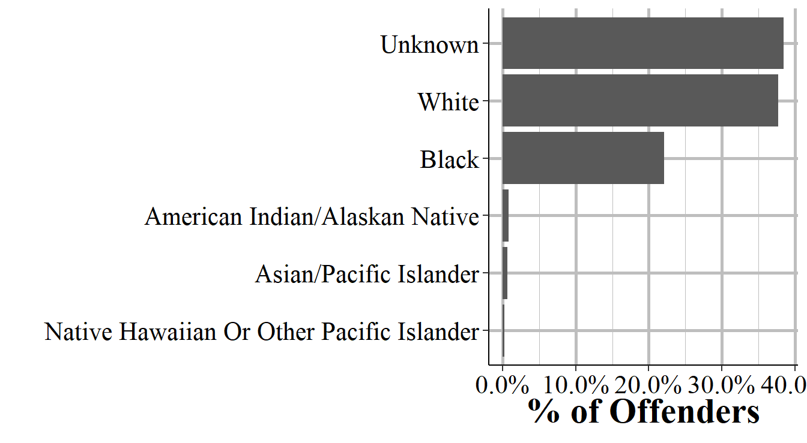

# Offender Segment

As might be expected, the Offender Segment provides information about who the offender is for each incident, though this is limited to only demographic variables. So we know the age, sex, and race of each offender but nothing else. This means that important variables such as criminal history, ethnicity, socioeconomic status, and motive are missing. In the Victim Segment we learn about the relationship between the victim and offender, and in the Offense Segment we learn which weapon (if any) the offender used. So there is some other data on the offender in other segments but its quite limited. This data has one row per offender so incidents with multiple offenders have multiple rows. In cases where there is no information about the offender there will be a single row where all of the offender variables will be "unknown". In these cases having a single row for the offender is merely a placeholder and doesn't necessarily mean that there was only one offender for that incident.

## Important variables

### Demographics

#### Age

#### Sex

#### Race

