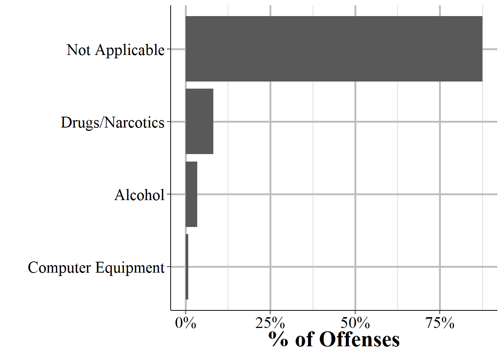
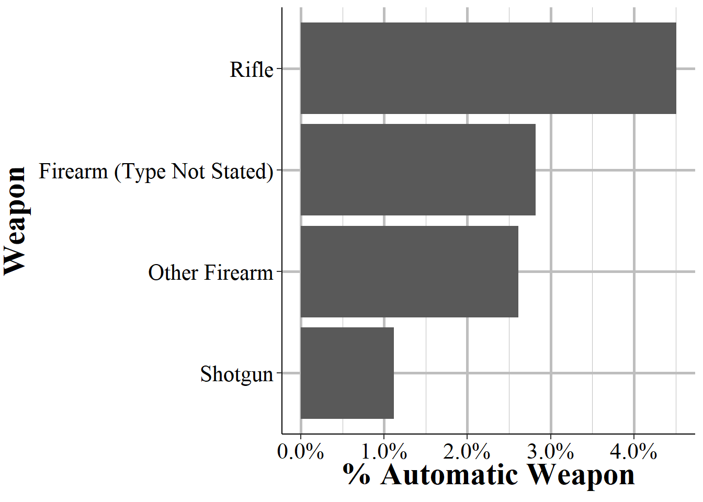
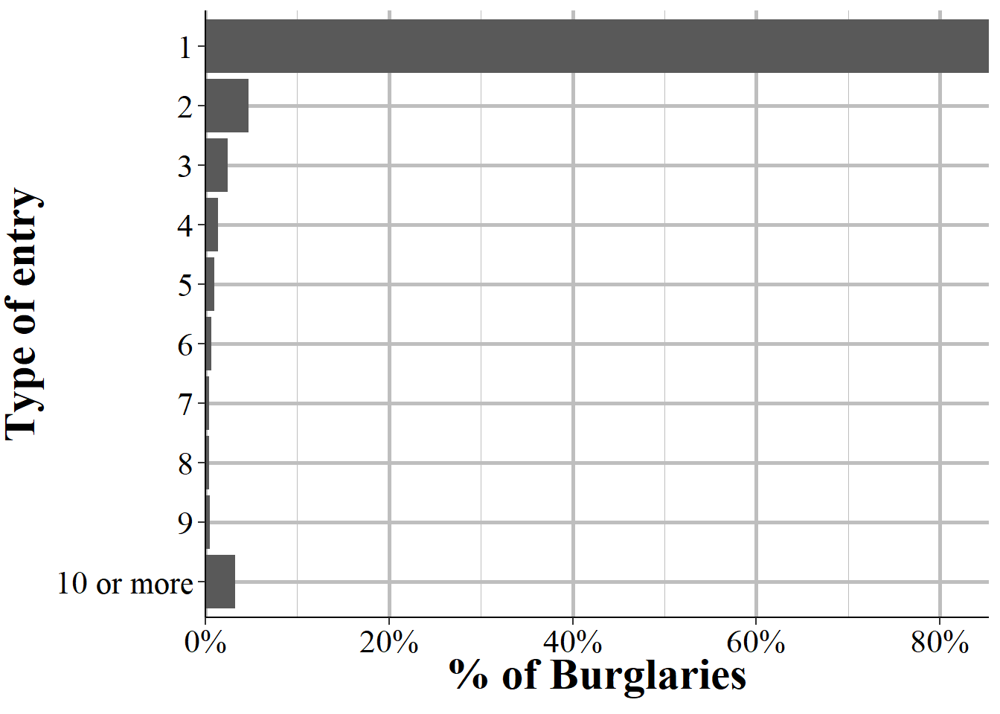
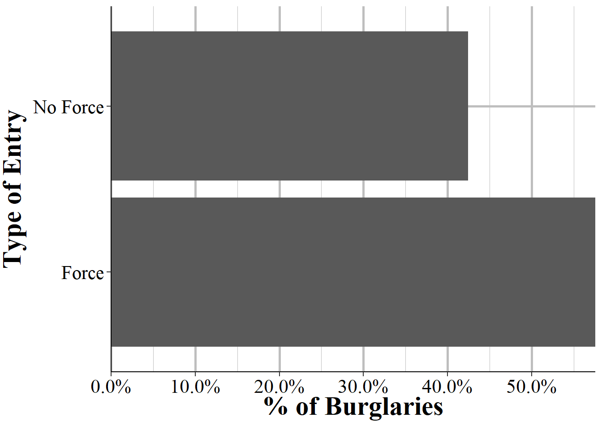

# Offense Segment {#offenseSegment}

This segment provides information about the offense that occurred, and each incident can have multiple offenses. This data tells you which offense occurred and for a subset of offenses it also provides a more detailed subcategory of offense, allowing a deeper dive into what exactly happened. For example, for animal abuse there are four subcategories of offenses: simple/gross neglect of an animal, intentional abuse or torture, animal sexual abuse (bestiality), and organized fighting of animals such as dog or cock fights. This segment also says what date the crime occurred on, where the crime occurred - in categories such as residence or sidewalk rather than exact coordinates in a city - whether the offender is suspected of using drugs, alcohol, or a computer, and which weapon was used. In cases where the weapon was a firearm it says whether that weapon was fully automatic or not. It also provides information on if the crime was a hate crime by including a variable on the bias motivation (if any) of the offender. This is based on evidence that the crime was motivated, at least in part, by the victim's group (e.g. race, sexuality, religion, etc.). There are 34 possible bias motivations and while hate crimes could potentially be motivated by bias against multiple groups, this data only allows for a single bias motivation.

## Important variables

In addition to the variables detailed below this segment has the tradition agency and incident identifiers: the ORI code, the agency state, the year of this data, and the incident number. It also has the date of the incident, which is also included in the Administrative Segment.^[Potentially some offenses could occur after the incident date. For example, if a incident happened at 11:50pm and it had multiple crimes involved, some of them may occur the follow day, such as at 12:01am.] 

### Crime category

The first important variable in the Offense Segment is figuring out exactly what offense was committed. This tells you what crime occurred in the incident. There can be multiple crimes in a single incident so this provides info about each crime that occurred. To figure out which offenses belong together, just look at the incident number and the ORI. Within ORI, each incident number is a unique identifier for an incident. Each crime is mutually exclusive and crimes which are elements of another crime are counted only as the crime they are elements of. For example, robberies are basically theft plus assault/intimidation - it is the use of force or threat of force (assault or intimidation) to take property (theft). A case of robbery in this data would only count as robbery, not as robbery and theft and assault/intimidation. If there are these crimes together in an incident that's because that crime *also* occurred separately. For example, if someone is robbed and after the robbery is over (i.e. they hand over their belongings) they are then punched repeatedly, that could potentially be classified as a robbery and an assault. 

Table \@ref(tab:offenseCrimeCategories) shows each possible crime in the data and how common it was in 2019. It's sorted by frequency instead of alphabetically so it's easier to see which crimes are most common. There were about 7.4 million crimes reported to NIBRS in 2019.  The most common crime is simple assault - which is an assault that didn't use a weapon and didn't result in serious injury - at 12.7% of crimes, or about 944k crimes. If you think this is odd because property crimes are more common than violent crimes, you'd be right. NIBRS data is pretty specific in its crime categories so it splits up certain crimes into a number of different categories. Theft is the most common crime committed in the United States. In NIBRS it's broken into several different types of theft so you need to combine them together to actually measure theft in its entirety. Of the top 6 most common crimes, theft crimes make up ranks 3, 5, and 6 (all other larceny, theft from motor vehicle, and shoplifting). 

Though each agency is supposed to report the same crimes - using the exact same definition of the crimes so the data is consistent - that isn't always true in practice. For example, animal cruelty became a NIBRS crime in 2018 (before that it wasn't an option so agencies could not report it) and likely most agencies in the US have had at least one animal abuse crime since then. In 2018, however, reporting was concentrated in a small number of states, meaning that not all agencies reported that offense. The concentration in certain states suggests that this low reporting is due to agencies in certain states deciding (or not being able to, such as if having older reporting systems which don't have animal cruelty as an option) not to report that offense at all. Reporting has increased in 2019 (though still remains highly concentrated), suggesting that over time more agencies begin reporting crimes as they are added. Therefore, I strongly suggest examining your data over time and across geographic areas to see if there are any biases before using it. 

Table: (\#tab:offenseCrimeCategories)The number and percent of crimes reported from all agencies in 2019, by crime category.

|Crime Category                                      | \# of Offenses| \% of Offenses|
|:---------------------------------------------------|--------------:|--------------:|
|Simple Assault                                      |        944,601|        12.70\%|
|Destruction/Damage/Vandalism of Property            |        821,523|        11.05\%|
|All Other Larceny                                   |        810,138|        10.89\%|
|Drug/Narcotic Violations                            |        710,822|         9.56\%|
|Theft From Motor Vehicle                            |        550,202|         7.40\%|
|Shoplifting                                         |        487,848|         6.56\%|
|Burglary/Breaking And Entering                      |        476,554|         6.41\%|
|Drug Equipment Violations                           |        327,715|         4.41\%|
|Motor Vehicle Theft                                 |        304,964|         4.10\%|
|Intimidation                                        |        279,040|         3.75\%|
|Aggravated Assault                                  |        271,444|         3.65\%|
|Theft From Building                                 |        212,507|         2.86\%|
|False Pretenses/Swindle/Confidence Game             |        195,003|         2.62\%|
|Credit Card/Atm Fraud                               |        134,527|         1.81\%|
|Weapon Law Violations                               |        134,182|         1.80\%|
|Counterfeiting/Forgery                              |        112,766|         1.52\%|
|Theft of Motor Vehicle Parts/Accessories            |        111,384|         1.50\%|
|Robbery                                             |         92,935|         1.25\%|
|Identity Theft                                      |         68,515|         0.92\%|
|Stolen Property Offenses (Receiving, Selling, Etc.) |         58,449|         0.79\%|
|Impersonation                                       |         57,920|         0.78\%|
|Fondling (Incident Liberties/Child Molest)          |         46,141|         0.62\%|
|Rape                                                |         46,049|         0.62\%|
|Embezzlement                                        |         24,166|         0.32\%|
|Kidnapping/Abduction                                |         22,757|         0.31\%|
|Pornography/Obscene Material                        |         19,814|         0.27\%|
|Arson                                               |         15,500|         0.21\%|
|Wire Fraud                                          |         15,373|         0.21\%|
|Sodomy                                              |         11,046|         0.15\%|
|Animal Cruelty                                      |          9,956|         0.13\%|
|Pocket-Picking                                      |          9,527|         0.13\%|
|Purse-Snatching                                     |          7,487|         0.10\%|
|Prostitution                                        |          7,309|         0.10\%|
|Murder/Nonnegligent Manslaughter                    |          6,095|         0.08\%|
|Extortion/Blackmail                                 |          5,583|         0.08\%|
|Statutory Rape                                      |          5,430|         0.07\%|
|Theft From Coin-Operated Machine Or Device          |          4,617|         0.06\%|
|Sexual Assault With An Object                       |          4,599|         0.06\%|
|Hacking/Computer Invasion                           |          2,765|         0.04\%|
|Assisting Or Promoting Prostitution                 |          2,283|         0.03\%|
|Purchasing Prostitution                             |          1,159|         0.02\%|
|Welfare Fraud                                       |            940|         0.01\%|
|Human Trafficking - Commercial Sex Acts             |            915|         0.01\%|
|Incest                                              |            762|         0.01\%|
|Operating/Promoting/Assisting Gambling              |            613|         0.01\%|
|Negligent Manslaughter                              |            561|         0.01\%|
|Bribery                                             |            544|         0.01\%|
|Gambling Equipment Violations                       |            351|         0.00\%|
|Justifiable Homicide                                |            300|         0.00\%|
|Betting/Wagering                                    |            260|         0.00\%|
|Human Trafficking - Involuntary Servitude           |            142|         0.00\%|
|Sports Tampering                                    |              7|         0.00\%|
|Total                                               |      7,436,090|          100\%|

### Offense subtype

In addition to the broader crime committed, NIBRS does allow for a "subtype" of crime variable which gives us a bit more information about what crime occurred (the variable is technically called the "type of criminal activity"). This is especially useful for certain crimes where it's not clear exactly what they're referring to from the crime category along. For example, for drug crimes we generally differentiate possession from sale or manufacturing. NIBRS combines everything into "drug/narcotic violations (crimes for drug materials such as syringes are classified as "drug equipment violations"). So we need to use the subtype variable to figure out what type of drug crime it is. Looking at the subtype we can see if the arrest is for "distributing/selling", "operating/promoting/assisting", "possessing/concealing", "transporting/transmitting/importing", or "using/consuming". There can be up to three subtypes per offense, so potentially an arrest can be related to something such as both possessing and selling drugs. 

There are also some unexpected subtypes related to certain offenses. For example, there are a few dozen drug offenses that also have the subtype of "exploiting children". This subtype is generally for cases where a child is abused, but happens here for drug offenses that don't have any associated child abuse (or for some of them, doesn't have any other crime at all) offense. The reason, I believe, for this category is that these offenses occurred in public so could have been viewed by children, and were labeled as exploiting children for that reason. If you're studying crimes against children, pulling from this variable would likely overcount crimes so - as always - you should make sure that the data you carefully check your data to odd things like this.^[Whether children viewing a crime, even a drug crime, would count as a crime against children would, of course, depend on your definition.]

This data is only available for the below subset of crimes, and isn't always present even for these crimes.

* Aggravated Assault
* Animal Cruelty
* Counterfeiting/Forgery
* Drug Equipment Violations
* Drug/Narcotic Violations
* Fondling (Incident Liberties/Child Molest)
* Gambling Equipment Violations
* Intimidation
* Kidnapping/Abduction
* Murder/Non-negligent Manslaughter
* Negligent Manslaughter
* Pornography/Obscene Material
* Rape
* Robbery
* Sexual Assault With An Object
* Simple Assault
* Sodomy
* Stolen Property Offenses (Receiving, Selling, Etc.)
* Weapon Law Violations

Table: (\#tab:offenseCrimeSubcategories)The number and percent of crime subtypes. This breakdown is only available for a subset of offenses.

|Crime Subcategory                                                                                                                            | \# of Offenses| \% of Offenses|
|:--------------------------------------------------------------------------------------------------------------------------------------------|--------------:|--------------:|
|Possessing/Concealing                                                                                                                        |      1,074,646|        44.35\%|
|None/Unknown Gang Involvement (Mutually Exclusive)                                                                                           |      1,040,062|        42.92\%|
|Distributing/Selling                                                                                                                         |        100,708|         4.16\%|
|Using/Consuming                                                                                                                              |         90,049|         3.72\%|
|Buying/Receiving                                                                                                                             |         46,692|         1.93\%|
|Cultivating/Manufacturing/Publishing                                                                                                         |         26,289|         1.08\%|
|Operating/Promoting/Assisting                                                                                                                |         12,446|         0.51\%|
|Transporting/Transmitting/Importing                                                                                                          |          7,821|         0.32\%|
|Simple/Gross Neglect (Unintentionally, Intentionally, Or Knowingly Failing To Provide Food, Water, Shelter, Veterinary Care, Hoarding, Etc.) |          6,996|         0.29\%|
|Other Gang                                                                                                                                   |          6,482|         0.27\%|
|Exploiting Children                                                                                                                          |          5,448|         0.22\%|
|Intentional Abuse And Torture (Tormenting, Mutilating, Poisoning, Or Abandonment)                                                            |          2,770|         0.11\%|
|Juvenile Gang Involvement                                                                                                                    |          2,582|         0.11\%|
|Animal Sexual Abuse (Bestiality)                                                                                                             |            104|         0.00\%|
|Organized Abuse (Dog Fighting And Cock Fighting)                                                                                             |             86|         0.00\%|
|Total                                                                                                                                        |      2,423,181|          100\%|

We'll look in more detail about the subtype of offenses for animal cruelty. Table \@ref(tab:offenseCrimeSubcategories) shows each possible subtype for animal cruelty and how often they occur. There were about 10,000 cases of animal cruelty reporting to NIBRS in 2019 and over two-thirds are for neglect of the animal. Over a quarter are for torturing or abandoning the poor animal. And the remaining small share of offenses are for sexual abuse of the animal or for forcing them to fight other animals. These subtypes provide a lot more information about the crime that occurred, but still has some uncertainties. We don't, for example, know the type of animal involved or the severity of the abuse (other than that it was serious enough for police to become involved). Still, this is a large improvement in our understanding of this crime (and others which have subtypes), and an colossal improvement when compared with UCR data. 

Table: (\#tab:offenseCrimeSubcategoriesAnimalAbuse)The number and percent of crime subtypes for animal abuse.

|Crime Subcategory                                                                                                                            | \# of Offenses| \% of Offenses|
|:--------------------------------------------------------------------------------------------------------------------------------------------|--------------:|--------------:|
|Simple/Gross Neglect (Unintentionally, Intentionally, Or Knowingly Failing To Provide Food, Water, Shelter, Veterinary Care, Hoarding, Etc.) |          6,996|        70.27\%|
|Intentional Abuse And Torture (Tormenting, Mutilating, Poisoning, Or Abandonment)                                                            |          2,770|        27.82\%|
|Animal Sexual Abuse (Bestiality)                                                                                                             |            104|         1.04\%|
|Organized Abuse (Dog Fighting And Cock Fighting)                                                                                             |             86|         0.86\%|
|Total                                                                                                                                        |          9,956|          100\%|

### Offense completed

For each offense, this segment also tells you if the offense was completed or only attempted. Some offenses, such as simple and aggravated assault or homicide, are only labeled as completed. This is because an attempted murder, for example, would be classified as aggravated assault. Since crimes in NIBRS are mutually exclusive, there cannot be both attempted murder and aggravated assault, so only aggravated assault is included. This does limit the data as it is important to know when an aggravated assault is done with the intent to kill the victim and when it's just to seriously harm the victim (though measuring this would likely be extremely imprecise since it requires knowing the motives of the offender). For other crimes, we do know if each crime was completed or not. In the vast majority of offenses they are completed. Table \@ref(tab:offensesCompleted) shows the percent of each crime category in 2019 NIBRS data that was completed or was only attempted.

Table: (\#tab:offensesCompleted)The percent of crimes completed or attempted, by crime category.

|Crime Category                                      | \% Completed| % Attempted|
|:---------------------------------------------------|------------:|-----------:|
|Aggravated Assault                                  |       100 \%|        0 \%|
|All Other Larceny                                   |     99.01 \%|     0.99 \%|
|Animal Cruelty                                      |     97.34 \%|     2.66 \%|
|Arson                                               |     94.83 \%|     5.17 \%|
|Assisting Or Promoting Prostitution                 |     95.84 \%|     4.16 \%|
|Betting/Wagering                                    |     77.69 \%|    22.31 \%|
|Bribery                                             |     84.74 \%|    15.26 \%|
|Burglary/Breaking And Entering                      |      93.2 \%|      6.8 \%|
|Counterfeiting/Forgery                              |     95.84 \%|     4.16 \%|
|Credit Card/Atm Fraud                               |     95.83 \%|     4.17 \%|
|Destruction/Damage/Vandalism of Property            |     99.52 \%|     0.48 \%|
|Drug Equipment Violations                           |     99.85 \%|     0.15 \%|
|Drug/Narcotic Violations                            |     99.67 \%|     0.33 \%|
|Embezzlement                                        |     99.27 \%|     0.73 \%|
|Extortion/Blackmail                                 |     53.88 \%|    46.12 \%|
|False Pretenses/Swindle/Confidence Game             |     90.39 \%|     9.61 \%|
|Fondling (Incident Liberties/Child Molest)          |     97.31 \%|     2.69 \%|
|Gambling Equipment Violations                       |     95.16 \%|     4.84 \%|
|Hacking/Computer Invasion                           |     91.21 \%|     8.79 \%|
|Human Trafficking - Commercial Sex Acts             |     89.62 \%|    10.38 \%|
|Human Trafficking - Involuntary Servitude           |     92.25 \%|     7.75 \%|
|Identity Theft                                      |     96.21 \%|     3.79 \%|
|Impersonation                                       |      93.6 \%|      6.4 \%|
|Incest                                              |     97.24 \%|     2.76 \%|
|Intimidation                                        |       100 \%|        0 \%|
|Justifiable Homicide                                |       100 \%|        0 \%|
|Kidnapping/Abduction                                |     94.52 \%|     5.48 \%|
|Motor Vehicle Theft                                 |     97.16 \%|     2.84 \%|
|Murder/Nonnegligent Manslaughter                    |       100 \%|        0 \%|
|Negligent Manslaughter                              |       100 \%|        0 \%|
|Operating/Promoting/Assisting Gambling              |     92.82 \%|     7.18 \%|
|Pocket-Picking                                      |     99.13 \%|     0.87 \%|
|Pornography/Obscene Material                        |     97.74 \%|     2.26 \%|
|Prostitution                                        |     94.16 \%|     5.84 \%|
|Purchasing Prostitution                             |     91.98 \%|     8.02 \%|
|Purse-Snatching                                     |      97.4 \%|      2.6 \%|
|Rape                                                |     96.66 \%|     3.34 \%|
|Robbery                                             |     90.36 \%|     9.64 \%|
|Sexual Assault With An Object                       |     97.83 \%|     2.17 \%|
|Shoplifting                                         |     98.81 \%|     1.19 \%|
|Simple Assault                                      |       100 \%|        0 \%|
|Sodomy                                              |     97.12 \%|     2.88 \%|
|Sports Tampering                                    |     85.71 \%|    14.29 \%|
|Statutory Rape                                      |     97.73 \%|     2.27 \%|
|Stolen Property Offenses (Receiving, Selling, Etc.) |     98.84 \%|     1.16 \%|
|Theft From Building                                 |     99.38 \%|     0.62 \%|
|Theft From Coin-Operated Machine Or Device          |     90.45 \%|     9.55 \%|
|Theft From Motor Vehicle                            |     92.91 \%|     7.09 \%|
|Theft of Motor Vehicle Parts/Accessories            |      98.8 \%|      1.2 \%|
|Weapon Law Violations                               |     98.55 \%|     1.45 \%|
|Welfare Fraud                                       |     92.45 \%|     7.55 \%|
|Wire Fraud                                          |     89.44 \%|    10.56 \%|

### Drug, alcohol, or computer use

Intoxication, mainly by alcohol, is known to be a major correlate (and cause) of crime. Drunk people commit a lot of crime (even though most drunk people never commit crime). NIBRS tries to capture this by telling us if the offender is *suspected of using* drugs (just "drugs", we don't know which drug though we could look in the Property Segment to see what drug [if any] was recovered), alcohol, or "computer equipment" which also includes cell phones. For each offense there are three variables about usage of any of these so potentially the offender could have used all three. The data doesn't get any more specific than if the offender is *suspected of using* these items. So we don't know how intoxicated they are or what they used the computer equipment for. Just that they're suspected of using it. And suspected is key. We don't know for sure if they used it. If, for example, a victim says that their mugger was drunk, NIBRS will say they're suspected of using alcohol, even though there's no definitive proof such as a blood test or breathalyzer. Unless some past variables like offense subtype where it applies to only a subset of crimes, this variable is available for every crime. 

Figure \@ref(fig:offenseDrugAlcoholComputer) shows the distribution is suspected usage for all offenses in 2019 NIBRS. This is just from the first suspected use variable for simplicity of the graph, even though there are three variables on this topic. The most common outcome is "Not Applicable" at 87.6% of offenses. Not Applicable actually just means that the offender was not suspected of using drugs, alcohol, or computer equipment. I'm not sure why it's called that but that's how NIBRS calls "none of the above". Since Not Applicable is so common, Figure \@ref(fig:offenseDrugAlcoholComputerAny) shows the distribution when excluding that option.

(\#fig:offenseDrugAlcoholComputer)The distribution of drug, alcohol, or computer use for all offenses in 2019.

Drug usage is the most common thing offenders are suspected of using, at about 66% of all crimes where they are suspected of using anything. Again, we don't know what type of drug was used, only that it wasn't alcohol. Alcohol follows at 28% while computer equipment is only 6.1%. 

(\#fig:offenseDrugAlcoholComputerAny)The distribution of drug, alcohol, or computer use for offenses where there was usage of one of these items. For easier viewing of how this variable is distributed, this figure excludes all offenses where there was no drug, alcohol, or computer use or the variable was NA.

### Crime location

My own research looks a lot at how the built environment affects behavior. For example, I have a few papers looking at how outdoor lighting affects crime. Outdoor lighting largely only effects outdoor crimes (since there are generally already lights indoors) so this variable in NIBRS has been crucial for my research. NIBRS tells us where each crime happened, giving more of a type of location rather than the precise location (e.g. coordinates) where it happened. Table \@ref(tab:offenseLocation) shows the 46 different location types where each offense could occur, sorted by most common to least common location. The most common place for a crime to occur is in someone's own home, at 40.4% of crimes. This makes a bit of sense as people spend a lot of time at home and certain crimes, such as burglary and domestic violence, happen a lot of the victim's own home. Crimes happening on a road or alley make up the second most common location at 16% and parking lot or garage follows at 8.6%. The remaining locations only make up 5% or fewer of offense locations.

But keep in mind that some locations may be a overly specific location that fits well into a broader category that you're interested in. For example, if you care about crimes that happen in stores you'd look at "Bank/Savings and Loan", "Restaurant", "Bar/Nightclub" among other locations, which combined have a lot more offenses than any one individually. This is a recurring theme of NIBRS data - you have a lot of data and some of it is so specific that you need to do extra work to aggregate data into units you want.

Table: (\#tab:offenseLocation)The location of crimes for all offenses reported in 2019.

|Crime Location                      | \# of Offenses| \% of Offenses|
|:-----------------------------------|--------------:|--------------:|
|Residence/Home                      |      3,001,159|        40.36\%|
|Highway/Road/Alley                  |      1,188,722|        15.99\%|
|Parking Lot/Garage                  |        637,986|         8.58\%|
|Department/Discount Store           |        373,338|         5.02\%|
|Other/Unknown                       |        349,477|         4.70\%|
|Convenience Store                   |        174,952|         2.35\%|
|Grocery/Supermarket                 |        171,702|         2.31\%|
|Commercial/Office Building          |        159,915|         2.15\%|
|Specialty Store (Tv, Fur, Etc.)     |        144,856|         1.95\%|
|Restaurant                          |        132,347|         1.78\%|
|School - Elementary/Secondary       |        119,901|         1.61\%|
|Hotel/Motel/Etc.                    |        118,313|         1.59\%|
|Service/Gas Station                 |        103,901|         1.40\%|
|Drug Store/Doctors Office/Hospital  |         74,861|         1.01\%|
|Bank/Savings And Loan               |         67,959|         0.91\%|
|Government/Public Building          |         59,118|         0.80\%|
|Bar/Nightclub                       |         55,220|         0.74\%|
|Park/Playground                     |         54,226|         0.73\%|
|Field/Woods                         |         40,011|         0.54\%|
|School - College/University         |         36,947|         0.50\%|
|Jail/Prison                         |         35,363|         0.48\%|
|Construction Site                   |         34,744|         0.47\%|
|Rental Storage Facility             |         34,630|         0.47\%|
|Shopping Mall                       |         32,532|         0.44\%|
|School/College                      |         31,330|         0.42\%|
|Cyberspace                          |         29,830|         0.40\%|
|Air/Bus/Train Terminal              |         28,409|         0.38\%|
|Church/Synagogue/Temple             |         26,470|         0.36\%|
|Auto Dealership New/Used            |         20,643|         0.28\%|
|Liquor Store                        |         15,237|         0.20\%|
|Industrial Site                     |         11,044|         0.15\%|
|Gambling Facility/Casino/Race Track |          9,688|         0.13\%|
|Shelter - Mission/Homeless          |          7,252|         0.10\%|
|Community Center                    |          7,191|         0.10\%|
|Lake/Waterway                       |          7,020|         0.09\%|
|Farm Facility                       |          5,992|         0.08\%|
|Arena/Stadium/Fairgrounds/Coliseum  |          5,256|         0.07\%|
|Camp/Campground                     |          5,251|         0.07\%|
|Abandoned/Condemned Structure       |          4,705|         0.06\%|
|Atm Separate From Bank              |          4,597|         0.06\%|
|Daycare Facility                    |          4,260|         0.06\%|
|Amusement Park                      |          3,429|         0.05\%|
|Dock/Wharf/Freight/Model Terminal   |          3,383|         0.05\%|
|Rest Area                           |          2,236|         0.03\%|
|Tribal Lands                        |            414|         0.01\%|
|Military Installation               |            273|         0.00\%|
|Total                               |      7,436,090|          100\%|

### Weapons

Using a weapon during a crime can greatly increase the severity of the offense, as evidenced by increased sanctions for using a weapon (and particularly a gun) and the enormous amount of attention - by the media, the public, and researchers - on gun crimes.^[The 2021 NYC mayor election, which as of this writing has not been completed yet, seems to hinge on an increase of gun violence in the city.] Luckily, NIBRS data tells us the weapon used in certain offenses. There can be up to three different weapon types included in an offense. NIBRS data doesn't provide a weapon used for all offenses, just for the ones that they deem to the violent crimes, and thus could involve a weapon. Please note that this is the weapons used in some capacity during the crime, not necessarily to harm the victim.^[The Victim Segment does have data on victim injuries though it doesn't say which weapon caused the injuries]. For example, if a gun is involved in a crime that gun may have been fired and missed the victim, fired and hit the victim, used to beat the victim, or merely brandished. From this data alone we don't know how it was used. 

The list of offenses where there is data on weapon usage is below:

* Aggravated Assault
* Extortion/Blackmail
* Fondling (Incident Liberties/Child Molest)
* Human Trafficking - Commercial Sex Acts
* Human Trafficking - Involuntary Servitude
* Justifiable Homicide
* Kidnapping/Abduction
* Murder/Nonnegligent Manslaughter
* Negligent Manslaughter
* Rape
* Robbery
* Sexual Assault With An Object
* Simple Assault
* Sodomy
* Weapon Law Violations

Table \@ref(tab:offenseWeapon) shows the breakdown in the weapons used in the above offenses. There were about 1.6 million offenses reported in NIBRS in 2019 that could have used a weapon. The most common weapon used was only the offender's body at 57.8% of offenses. The "personal weapons (hands, feet, teeth, etc.) basically means that the offender used or threatened force but wasn't carrying a weapon. So this includes things like punching, kicking, biting, wrestling, and anything you may see in a boxing or MMA match. Strangulation can be done without any weapons but as strangulation is its own weapon, it is not included in the "personal weapons" category. The next most common group is the offender doesn't have any weapons, and doesn't use their body as a weapon, at a little over 10% of offenses, following by the offender using a handgun in 9.4% of offenses. 

"Other" is the next most common category which just means any weapon not already included in the weapon categories. Knife/cutting instrument makes up 4.5% of offenses are is a rather broad category, composed of anything that could cut or pierce someone's body. The most likely weapon in this category is a knife, but can extend to rarer items like broken glass or a sword. The remaining weapon groups are rarer than 4% of offenses, but given that NIBRS covers so many crimes these weapons still occur in hundreds or thousands of cases.

Table: (\#tab:offenseWeapon)The weapon used by an offender in the crime for all offenses reported in 2019. The use means that it was part of the crime though may not have been physically discharged. For example, pointing a gun at someone even without firing the gun is still using it.

|Weapon Used                                                       | \# of Offenses| \% of Offenses|
|:-----------------------------------------------------------------|--------------:|--------------:|
|Personal Weapons (Hands, Feet, Teeth, Etc.)                       |        918,134|        57.84\%|
|None                                                              |        161,623|        10.18\%|
|Handgun                                                           |        149,146|         9.40\%|
|Other                                                             |         90,385|         5.69\%|
|Knife/Cutting Instrument (Ice Pick, Screwdriver, Ax, Etc.)        |         71,311|         4.49\%|
|Firearm (Type Not Stated)                                         |         58,920|         3.71\%|
|Unknown                                                           |         57,430|         3.62\%|
|Blunt Object (Club, Hammer, Etc.)                                 |         36,536|         2.30\%|
|Motor Vehicle                                                     |         17,278|         1.09\%|
|Rifle                                                             |          7,696|         0.48\%|
|Shotgun                                                           |          5,896|         0.37\%|
|Asphyxiation (By Drowning, Strangulation, Suffocation, Gas, Etc.) |          4,984|         0.31\%|
|Other Firearm                                                     |          4,633|         0.29\%|
|Drugs/Narcotics/Sleeping Pills                                    |          1,239|         0.08\%|
|Explosives                                                        |            949|         0.06\%|
|Fire/Incendiary Device                                            |            715|         0.05\%|
|Poison (Include Gas)                                              |            475|         0.03\%|
|Total                                                             |      1,587,350|          100\%|

### Automatic weapons

When the weapon involved was a firearm there is a variable which indicates that the firearm was fully automatic. To be clear, this means that when you pull the trigger once the gun will fire multiple bullets. Semi-automatic firearms are **not** automatic firearms. Of course, saying a gun is fully automatic requires either the policing seizing the gun or the gun being fired (and for witnesses to accurately determine that it is fully automatic). Since most crimes are never solved (and even those that lead to an arrest may not lead to the gun being seized - though some guns are seized even without an arrest, such as if the gun is left at the crime scene) and most gun crimes don't actually involve the gun being fired, this variable is likely very imprecise. Still, Figure \@ref(fig:offenseAutomaticWeapon) shows the percent of firearms used in offenses in 2019 that are reported to be fully automatic. Even though there can be up to three weapons used in an offense, this figure only looks at the first weapon. The most common guns to be automatic are rifles and handguns, both with about 4.5% of all uses being of an automatic weapon. The remaining categories are all under 3% of uses. 

(\#fig:offenseAutomaticWeapon)The percent of firearms used that were fully automatic, for all offenses in 2019.

### Burglary info

For burglary offenses specifically there are two variables that provide a little more information on the offense. The first variable is the number of "premises" that the burglar entered. This is only available when the location for the offense is either hotel/motel or a rental storage facility. So the "premise" can really be thought of as a room in the building, not that they break into multiple hotels. Figure \@ref(fig:offensePremisesEntered) shows the breakdown in the number of premises entered during a burglary incident. The graph is capped at 10 or more but in 2019 the highest number was 99 buildings entered, which is the maximum value the police can enter, so in reality it may have been higher. The vast majority of hotel/motel and storage facility burglaries only have one room entered, with 85% of these burglaries only being on a single room. This declines enormously to 4.7% burglarizing two rooms and then nearly halves to 2.5% burglarizing three rooms. This trend continues as the number of rooms increase. 

(\#fig:offensePremisesEntered)The distribution in the number of premises entered during burglaries. This info is only available for burglaries in a hotel/motel or rental storage facilities.

The second variable, and one where there is data from every burglary reported regardless of location, says whether the burglar entered the building forcibly or not. A burglary without force is one when the burglary *only* enters through unlocked doors or windows. The *only* means that if they entered through an unlocked door or window and then forced open another door or window, the entire burglary is classified as forcible entry. forcible entry is any when the burglar has to access through any means a locked door or window. This is very broad and includes actions ranging from breaking the window - which people generally think of when it comes to forcible entry - to less obvious uses of force like picking the lock or even using a passcard (e.g. a hotel room card) to unlock the door. The FBI also includes when a burglar enters a building legally and then stays past their allowed time (e.g. walk into a store and hide somewhere until past closing time). 

Figure \@ref(fig:offensesTypeOfEntry) shows the breakdown in burglaries by type of entry. The majority of burglaries, 57.6%, use force at some point in the burglary. 42.4% don't use force at all. There's no option for "unknown" if force was used so my guess is that when in doubt - that is, when there's no evidence of force - the police report that no force is used.  

(\#fig:offensesTypeOfEntry)The percent of burglaries reported in 2019 where the burglary entered the structure forcibly or non-forcibly.

### Hate crime indicator (bias motivation)

For each offense NIBRS indicates whether it had a bias motivation, which is NIBRS way of saying if it was a hate crime or not. For the police to classify an incident as a hate crime, and to assign a particular bias motivation, the police must have some evidence that the crime was motivated by hate. The victim saying that the crime is a hate crime alone is not sufficient - though if large portions of the victim’s community believe that the crime is a hate crime, this is a factor in the police’s assessment. The evidence required is not major, it includes things as explicit as racial slurs said during an incident and less obvious factors like the victim is celebrating their community (e.g. attending a holiday event) or the crime occurring on an important holiday for that community (e.g. Martin Luther King Day, religious holidays). The FBI also encourages police to consider the totality of the evidence even if none alone strongly suggests that the crime was a hate crime in making their determination about whether the incident was a hate crime or not.

This also means that many (likely most) hate crimes will not be recorded as hate crimes since there is no evidence that the crime is motivated by hate. For example, if a man committed a crime against Asian people for crimes because they are Asian, that would in reality be a hate crime. However, if the offender does not say anything anti-Asian to the victim, which is the mostly likely thing to indicate that this is a hate crime, the crime would not likely be recorded as a hate crime. For example, at the time of this writing (Spring, 2021), there are numerous media reports discussing an increase in anti-Asian hate crimes as a result of racism relating to the pandemic.48 This data would likely undercount both anti-Asian behavior and anti-Asian hate crimes. First, if someone walked to an Asian person and called them an anti-Asian slur, that is clearly a hateful act and would be classified as a hate crime under some organization’s collections methods. However, as hateful as this incident is, this alone would not be classified as a hate crime in this dataset as a slur is not a crime. If accompanied by other criminal behavior, or if it continues to the point where it can be considered intimidation, it would then be classified as a hate crime. Second, crimes against Asian victims that are in fact hate crimes, but have no evidence that they are hate crimes would not be classified as hate crimes in this data.

Bias motivation is based on the offender’s perceptions of the victim so even if they are incorrect in who their victim is, if they intended to target someone for their perceived group membership, that is still a hate crime. For example, if a person assaults a man because they think he is gay, that is a hate crime because the assault was motivated by hate towards gay people. Whether the victim is actually gay or not is not relevant - the offender perceived him to be gay so it is an anti-gay hate crime. To make this even more complicated, the offender must have committed the crime because they are motivated, at least to some degree, by their bias against the victim. Being biased against the victim but targeting them for some other reason means that the crime is not a hate crime.

Table \@ref(tab:offenseBiasMotivation) shows the percent of all offenses in 2019 that were classified with or without a bias motivation. Nearly all offenses - 99.14% - are without a bias motivation meaning that they are not considered hate crimes. This still leaves a large 63,876 offenses classified as hate crimes. 

Table: (\#tab:offenseBiasMotivation)The number and percent of offenders that had a bias motivation or not for all offenses reported in 2019.

|Bias Motivation    | \# of Offenses| \% of Offenses|
|:------------------|--------------:|--------------:|
|No Bias Motivation |      7,372,214|        99.14\%|
|Bias Motivation    |         63,876|         0.86\%|
|Total              |      7,436,090|          100\%|

Table \@ref(tab:offenseBiasMotivationBiases) shows the breakdown in the bias motivation of hate crimes, for all incidents where the crime is considered a hate crime. The most common bias motivation is anti-Black, which accounts for 29% of all hate crimes in the data. This is followed by anti-White at 12.7% and "anti-male homosexual (gay)" at almost 8% of crimes. The only other biases that make up more than 5% of hate crimes are anti-Hispanic and anti-Jewish.^[Looking at the raw percents is a rather naive measure as it assumes that all groups have equal risk of hate crimes. Certain groups, such as Jews and transgender people, make up a relatively small share of the percent of hate crimes but when considering their percent of the overall population (itself only a slightly better measure as even total population doesn't account for true opportunity to be victimized) are victimized at much higher rates than many other groups.]

Some of these groups are also subsets of larger groups. For example, anti-Muslim, anti-Arab, and anti-Sikh (while Sikhs are not Muslim or Arabic, some Sikhs have been targeted by people who incorrectly believe that they are) are probably all the same bias motivation. Likewise, attacks on LGBT people are in multiple categories, which allows for a more detailed understanding of these hate crimes but requires aggregation to look at them as a group. While this aggregation is easy enough to do, accidentally missing any of the subcategories could vastly undercount offenses against the larger category.  

Table: (\#tab:offenseBiasMotivationBiases)The bias motivation (i.e. if hate crime or not and what type of hate crime) for all offenses reported in 2019 that were classified as hate crimes. For easier viewing of how hate crimes are broken down, this excludes all offenses where there was no bias motivation.

|Bias Motivation                                | \# of Offenses| \% of Offenses|
|:----------------------------------------------|--------------:|--------------:|
|Anti-Black                                     |          1,309|        28.99\%|
|Anti-White                                     |            573|        12.69\%|
|Anti-Male Homosexual (Gay)                     |            357|         7.91\%|
|Anti-Hispanic                                  |            310|         6.86\%|
|Anti-Jewish                                    |            249|         5.51\%|
|Anti-Homosexual (Both Gay And Lesbian)         |            213|         4.72\%|
|Anti-Other Ethnicity/National Origin           |            210|         4.65\%|
|Anti-American Indian Or Alaskan Native         |            125|         2.77\%|
|Anti-Mental Disability                         |            107|         2.37\%|
|Anti-Asian/Pacific Islander                    |            101|         2.24\%|
|Anti-Multi-Racial Group                        |             97|         2.15\%|
|Anti-Islamic (Muslim)                          |             86|         1.90\%|
|Anti-Female Homosexual (Lesbian)               |             70|         1.55\%|
|Anti-Transgender                               |             68|         1.51\%|
|Anti-Sikh                                      |             66|         1.46\%|
|Anti-Arab                                      |             64|         1.42\%|
|Anti-Other Religion                            |             63|         1.40\%|
|Anti-Gender Non-Conforming                     |             59|         1.31\%|
|Anti-Female                                    |             51|         1.13\%|
|Anti-Eastern Orthodox (Greek, Russian, Etc.)   |             50|         1.11\%|
|Anti-Physical Disability                       |             44|         0.97\%|
|Anti-Catholic                                  |             42|         0.93\%|
|Anti-Other Christian                           |             40|         0.89\%|
|Anti-Native Hawaiian Or Other Pacific Islander |             30|         0.66\%|
|Anti-Protestant                                |             26|         0.58\%|
|Anti-Multi-Religious Group                     |             25|         0.55\%|
|Anti-Bisexual                                  |             22|         0.49\%|
|Anti-Male                                      |             17|         0.38\%|
|Anti-Heterosexual                              |             12|         0.27\%|
|Anti-Mormon                                    |              7|         0.16\%|
|Anti-Hindu                                     |              7|         0.16\%|
|Anti-Buddhist                                  |              6|         0.13\%|
|Anti-Atheism/Agnosticism                       |              5|         0.11\%|
|Anti-Jehovahs Witness                          |              5|         0.11\%|
|Total                                          |          4,516|          100\%|
