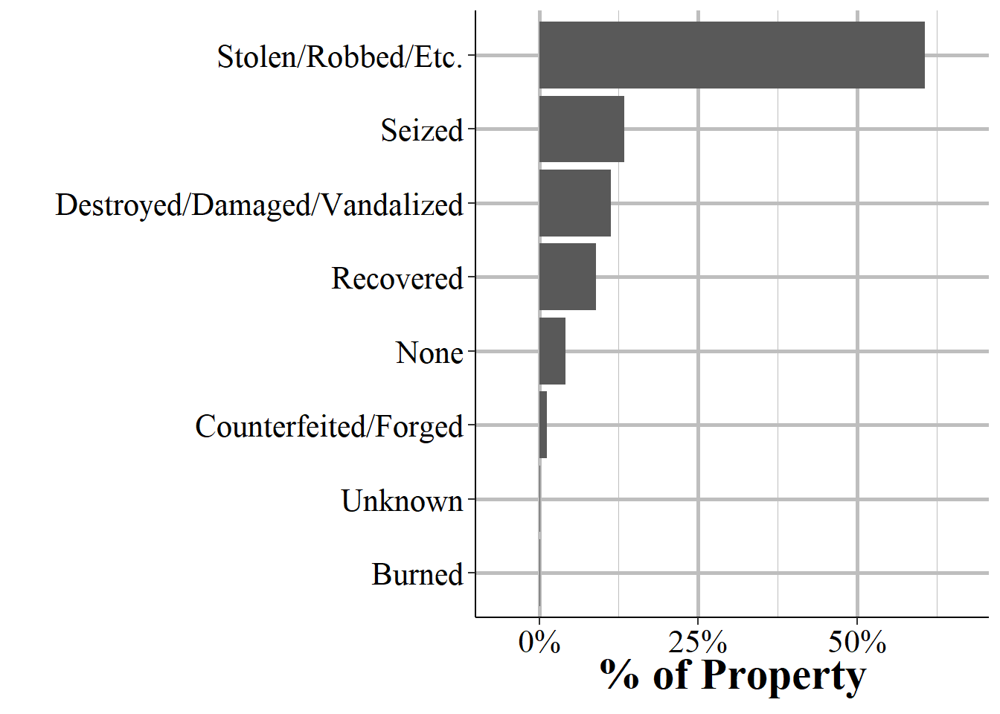
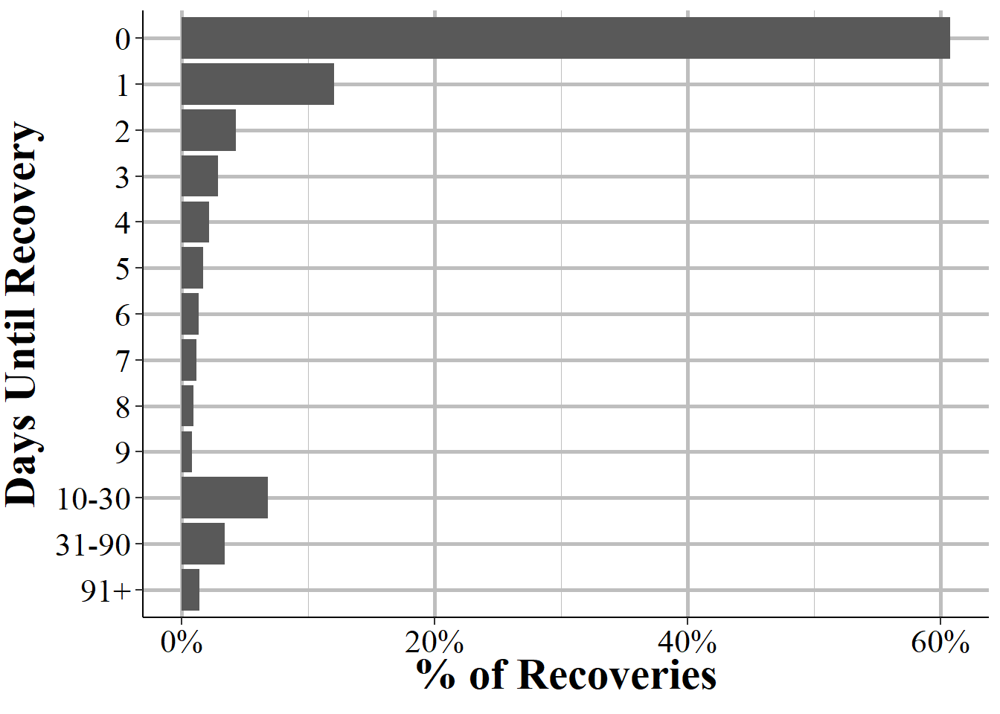

# Property and Window Property Segment


## Important variables

### Description of property


```{=html}
<div id="htmlwidget-ee73a3c4f3eac673a20c" style="width:100%;height:auto;" class="datatables html-widget"></div>
<script type="application/json" data-for="htmlwidget-ee73a3c4f3eac673a20c">{"x":{"filter":"none","data":[["1","2","3","4","5","6","7","8","9","10","11","12","13","14","15","16","17","18","19","20","21","22","23","24","25","26","27","28","29","30","31","32","33","34","35","36","37","38","39","40","41","42","43","44","45","46","47","48","49","50","51","52","53","54","55","56","57","58","59","60","61","62","63","64","65","66","67","68"],["Other","Drugs/Narcotics","Automobiles","Money","Vehicle Parts/Accessories","Clothes/Furs","Drug/Narcotic Equipment","Purses/Handbags/Wallets","Merchandise","Credit/Debit Cards","Tools - Power/Hand","Consumable Goods","Portible Electronic Communications","Computer Hardware/Software","Household Goods","Identity Documents","Radios/Tvs/Vcrs","Jewelry/Precious Metals","Firearms","Bicycles","Trucks","Negotiable Instruments","Identity - Intangible","Structures - Single Occupancy Dwellings","Alcohol","Documents - Personal Or Business","Building Materials","Office-Type Equipment","Lawn/Yard/Garden Equipment","Other Motor Vehicles","Nonnegotiable Instruments","Structures - Other","Trailers","Recreational/Sports Equipment","Structures - Commercial/Business","Structures - Other Dwellings","Photographic/Optical Equipment","Recordings - Audio/Visual","Camping/Hunting/Fishing Equipment/Supplies","Heavy Construction/Industrial Equipment","Fuel","Weapons - Other","Pending Inventory (Of Property)","Firearm Accessories","Collections/Collectibles","Structures - Public/Community","Musical Instruments","Recreational Vehicles","Metals, Non-Precious","Medical/Medical Lab Equipment","Farm Equipment","Pets","Structures - Storage","Artistic Supplies/Accessories","Watercraft","Explosives","Chemicals","Gambling Equipment","Watercraft Equipment/Parts/Accessories","Law Enforcement Equipment","Livestock","Crops","Buses","Logging Equipment","Structures - Industrial Manufacturing","Special Category","Aircraft Parts/Accessories","Aircraft"],[1005616,714797,645115,637046,328970,312506,292097,291694,266945,242981,240156,236104,201787,192970,192923,185098,169518,123742,117039,89936,83796,73327,71331,64507,64339,62883,54091,53707,48398,46222,41596,33265,30124,29946,27401,23936,23579,23358,22040,17546,17013,16690,14262,14053,12763,11351,10047,10020,9951,9212,8831,8071,7019,4705,3775,3671,3549,3226,2628,2610,2114,2094,1962,1437,1398,1277,761,455],[0.132888317841175,0.0944576965043502,0.0852494860504505,0.084183198484759,0.0434721304356847,0.041296475648035,0.0385995041610851,0.0385462492485838,0.0352757633193113,0.0321090121451594,0.0317356991729102,0.0312002428318293,0.0266653822057498,0.0255002492937778,0.025494038423089,0.024459994526505,0.0224011569662777,0.0163520332078077,0.0154662573306444,0.0118846992821951,0.011073321707112,0.00968988329773976,0.0094261195127453,0.00852435394721315,0.0085021533881555,0.0083097485429892,0.00714791928563887,0.00709717515064995,0.00639561105519125,0.00610806095692074,0.00549675270572617,0.00439584283959951,0.00398077167293238,0.00395724965202606,0.00362093761153964,0.00316305108097561,0.00311587489297811,0.00308667058612251,0.00291250191446785,0.00231863695967572,0.00224820304314163,0.0022055198254296,0.00188466888857262,0.00185705033593542,0.00168658175745704,0.00149999134442489,0.00132767271935837,0.00132410477236696,0.00131498668561114,0.00121733065499446,0.00116698295856015,0.00106655185806125,0.00092753407158121,0.000621747799799059,0.000498851847872783,0.000485108644646619,0.00046898681009285,0.000426303592380821,0.000347280173830377,0.000344901542502772,0.000279357034808759,0.000276714111111419,0.00025927081470898,0.000189894067653825,0.000184740366444014,0.000168750678075111,0.000100563246683758,6.01265141144679e-05]],"container":"<table class=\"display\">\n  <thead>\n    <tr>\n      <th> <\/th>\n      <th>Property<\/th>\n      <th># of Property Stolen<\/th>\n      <th>% of Property Stolen<\/th>\n    <\/tr>\n  <\/thead>\n<\/table>","options":{"pageLength":100,"columnDefs":[{"targets":2,"render":"function(data, type, row, meta) {\n    return type !== 'display' ? data : DTWidget.formatRound(data, 0, 3, \",\", \".\");\n  }"},{"targets":3,"render":"function(data, type, row, meta) {\n    return type !== 'display' ? data : DTWidget.formatPercentage(data, 2, 3, \",\", \".\");\n  }"},{"className":"dt-right","targets":[2,3]},{"orderable":false,"targets":0}],"order":[],"autoWidth":false,"orderClasses":false}},"evals":["options.columnDefs.0.render","options.columnDefs.1.render"],"jsHooks":[]}</script>
```


### Type of property loss




### Value of stolen property


### Date property was recovered




### Drugs

#### Suspected drug type


```{=html}
<div id="htmlwidget-374e978e7a052ac4c04a" style="width:100%;height:auto;" class="datatables html-widget"></div>
<script type="application/json" data-for="htmlwidget-374e978e7a052ac4c04a">{"x":{"filter":"none","data":[["1","2","3","4","5","6","7","8","9","10","11","12","13","14","15","16"],["Marijuana","Amphetamines/Methamphetamines","Heroin","Cocaine (All Forms Except Crack)","Crack Cocaine","Unknown Type Drug","Other Narcotics: Codeine, Demerol, Dihydromorphinone Or Dilaudid, Hydrocodone Or Percodan, Methadone, Etc.","Pcp","Hashish","Other Hallucinogrens: Bmda (White Acid), Dmt, Mda, Mdma, Mescaline Or Peyote, Psilocybin, Stp, Etc.","Other Depressants: Glutethimide Or Doriden, Methaqualone Or Quaalude, Pentazocine Or Talwin, Etc.","Other Stimulants: Adipex, Fastine And Ionamin (Derivatives of Phentermine), Benzedrine, Didrex, Methylphenidate Or Ritalin, Phenmetrazine Or Preludin, Tenuate, Etc.","Opium","Lsd","Morphine","Barbiturates"],[455429,201716,82437,49699,49646,39836,37401,30348,7046,6256,5165,3368,2984,1624,1297,1276],[0.466853847352408,0.206776227847894,0.0845050065195463,0.0509457442533684,0.0508914147005519,0.0408353219999836,0.03833923782813,0.0311093069599232,0.00722275526689137,0.00641293740415447,0.00529456868485579,0.0034524893186049,0.00305885633216063,0.00166473950517053,0.00132953641515159,0.00130800961120542]],"container":"<table class=\"display\">\n  <thead>\n    <tr>\n      <th> <\/th>\n      <th>Drug Type<\/th>\n      <th># of Drugs<\/th>\n      <th>% of Drugs<\/th>\n    <\/tr>\n  <\/thead>\n<\/table>","options":{"pageLength":100,"columnDefs":[{"targets":2,"render":"function(data, type, row, meta) {\n    return type !== 'display' ? data : DTWidget.formatRound(data, 0, 3, \",\", \".\");\n  }"},{"targets":3,"render":"function(data, type, row, meta) {\n    return type !== 'display' ? data : DTWidget.formatPercentage(data, 2, 3, \",\", \".\");\n  }"},{"className":"dt-right","targets":[2,3]},{"orderable":false,"targets":0}],"order":[],"autoWidth":false,"orderClasses":false}},"evals":["options.columnDefs.0.render","options.columnDefs.1.render"],"jsHooks":[]}</script>
```


#### Amount of drugs


* Dosage Unit/Items (Pills, Etc.)
* Fluid Ounce
* Gallon                   
* Gram
* Kilogram       
* Liter                   
* Milliliter
* Not Reported
* Number of Plants           
* Ounce
* Pound


