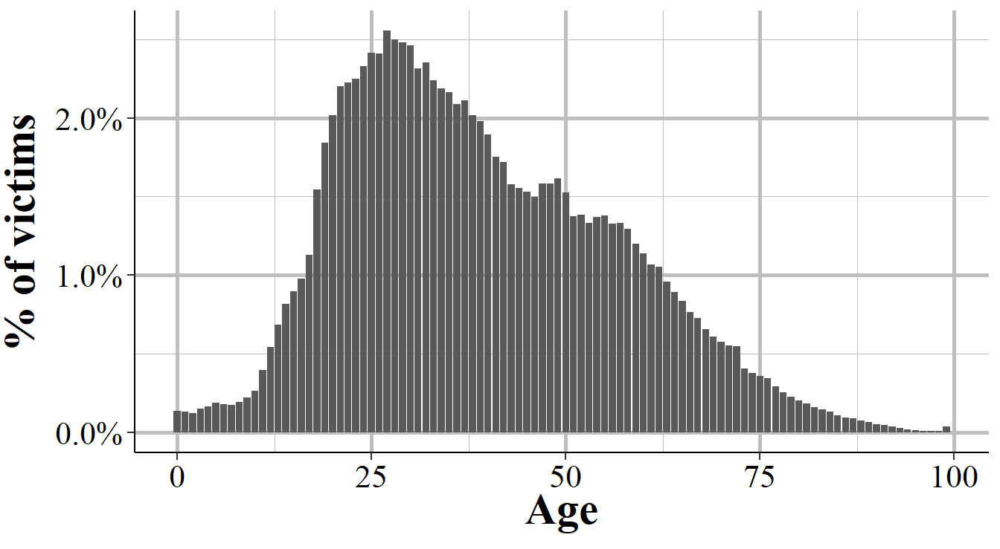
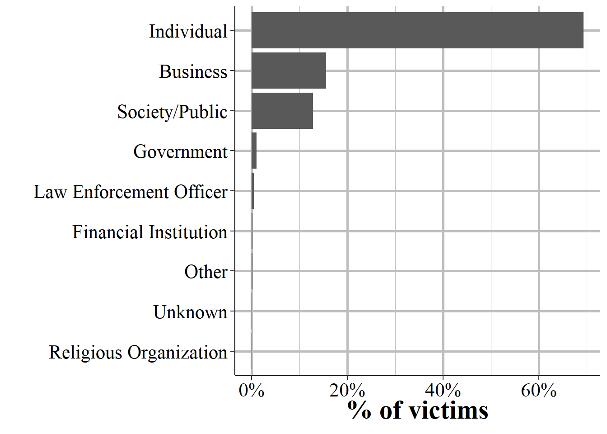
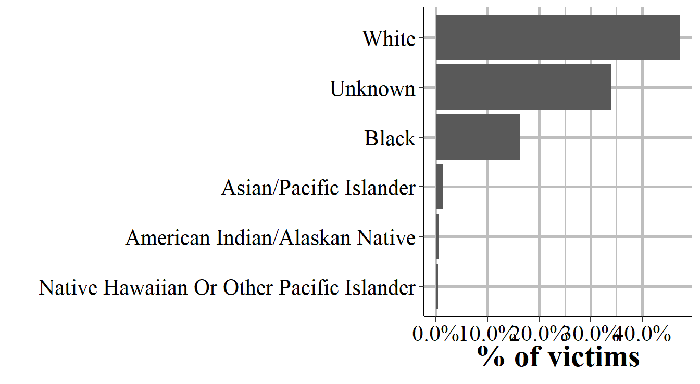
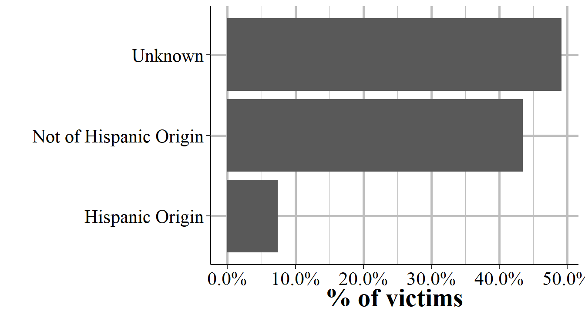

# Victim Segment

## Important variables

### Crime category

### Victim type

### Injury

### Relationship to offender

### Residence status

### Age

### Sex

### Race

### Ethnicity

### Homicide type

