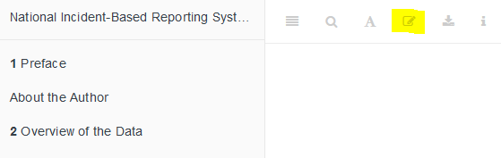

--- 
title: "National Incident-Based Reporting System (NIBRS) Data: A Practitioner's Guide"
author: "Jacob Kaplan"
date: "`r Sys.Date()`"
site: bookdown::bookdown_site
documentclass: book
lof: yes
lot: yes
bibliography: [book.bib]
biblio-style: apalike
link-citations: yes
description: "This is a comprehensive guide to using the FBI's National Incident-Based Reporting System (NIBRS) Data, an incident-level dataset which provides detailed information on every crime reported to the police, including victim and offender traits and characteristics of the crime."
graphics: yes
always_allow_html: true 
colorlinks: yes
url: "https://nibrsbook.com"
fontsize: 12pt
github-repo: "jacobkap/nibrsbook"
classoption: openany
linestretch: 1.15
geometry: margin=1in
tables: yes
---

```{r, echo=FALSE}
knitr::opts_chunk$set(
  echo    = FALSE,
  warning = FALSE,
  error   = FALSE
)
```

```{r setup, include=FALSE}
options(
  htmltools.dir.version  = FALSE,
  formatR.indent         = 1,
  width                  = 65,
  digits                 = 4,
  warnPartialMatchAttr   = FALSE,
  warnPartialMatchDollar = FALSE,
  echo                   = FALSE,
  warning                = FALSE
)


# bookdown::render_book("index.Rmd", "bookdown::pdf_book", output_file = "nibrsbook.pdf")
# bookdown::render_book("index.Rmd", "bookdown::epub_book", output_file = "nibrsbook.epub")
# bookdown::render_book("index.Rmd", "bookdown::gitbook")
```

# Preface 

The average American had, in 2019, about a 1 in 20,500 chance of being murdered, 1 in 1,223 chance of being robbed, and a 1 in 64 chance of having something they own stolen.^[This is according to data from the FBI's 2019 Crime in the United States report.] Getting these numbers is extremely simple. We take the number of crimes reported to the police and divide it by the number of people living in the United States that year. For example, there were about 16,000 murders in 2019 and 328 million people in the country - 16,000 / 328 million = ~1/20,500. You'll more commonly see this - in news articles, in political speeches, in research articles, on TV, etc. - reported as the rate per 100,000 people but that's just a matter of conversion, the numbers are the same. This is, however, totally wrong. It assumes - and let's now just pretend that there's no underreporting of crimes to the police so the reported number of crimes is the true number of crimes - that every single person has the exact same risk of victimization. We know this is wrong intuitively. There are the "bad parts of town" or people who "run with the wrong crowd." Research in criminology backs this up by finding that crime is generally concentrated among a small group of people and within a small geographic area (usually a very small number of streets or neighborhoods in a city). From surveys that ask if people have been victims of a crime we also know that victimization rates differ by age, race, gender, income, and city type. Indeed, think of a personal characteristic (e.g. risk tolerance, athleticism, frequency outdoors) and there will probably be large differences in the likelihood of being a victim within these groups.

So why do people so frequently talk about crime as rates per total population? Why assume that everyone has equal risk of being a victim? The major reason, I think, is that the main FBI dataset on crime, the [Uniform Crime Reporting (UCR) System Data](https://ucrbook.com/) doesn't provide any information about crime victims other than for homicide and hate crime victims.^[There is a small amount of information available for property theft victims, but not enough to do these kinds of victimization rate calculations] Victimization surveys are nearly all at state or national levels so trying to use their results for specific city-level rates will have very high levels of imprecision, likely enough to make the results unhelpful. So by necessity people tend to assume equal risk since there's not good data to do so otherwise. Doing so, however, is a large mistake in my opinion. It both overstates and understates risk, often very drastically. For example, many murders are concentrated among young minority men in impoverished areas of urban cities. Their risk of being murdered is many times higher than you'd expect from simply dividing murders by city population overall. And the risk for other people in the city is far smaller than you'd expect from the naive risk value. 

While UCR data is the predominant dataset in criminology and the one that truly guides America's perceptions of crime, there is actually one that is far more detailed and allows us do a much better (though far from perfect) measure of crime victimization by a number of victim traits. This dataset, called the National Incident-Based Reporting System - and often called by its abbreviation NIBRS - provides demographics information about each victim of crime. Like the UCR this is a dataset from the FBI which standardizes information from agencies in the United States so it is comparable across agencies and over time (with some caveats). This data includes the age, race, gender, and the relationship of the victim to the offender for every known victim. We also have info about the offense such as which crimes occurred (and unlike the UCR, incidents can have multiple offenses), where and when it occurred, and what weapons (if any) we used. And we have demographic information about offenders, and whether they were arrested (including the type of arrest such as if the police had a warrant and arrested them or saw them committing the crime and arrested them at the scene). From this we can figure out victimization rates based on certain (though not all) victim characteristics.

Of course, the research opportunities from this highly detailed data extend far beyond mere victimization rates. Personally I've used the data to examine topics ranging from marijuana decriminalization and domestic violence injuries to daylight saving time's effect on crime clearance. As of this writing in early summer 2021, [Google Scholar has over 1,500 results for NIBRS research since 2017](https://scholar.google.com/scholar?as_ylo=2017&q=NIBRS&hl=en&as_sdt=0,44). As the FBI has said that starting in 2021 NIBRS data will completely replace UCR data, this is crime dataset of the future (though I believe that UCR will still be heavily used for many years to come). For graduate students and early career researchers, this is likely the dataset that you'll use for your entire career.

## Goal of the book

By the end of the book you should have a firm grasp on NIBRS data and how to use it (or as is occasionally the case, choose not to use it) properly. However, this book can't possibly cover every potential use case for the data so make sure to carefully examine the data yourself for your own particular use. 

I get a lot of emails from people asking questions about this data so my own goal is to create a single place that answers as many questions as I can about the data.^[Writing also keeps away the boredom.] As the FBI has moved to only use NIBRS data starting in 2021, I expect the uses of this data - and thus the number of emails I get - to grow very quickly. This is an increasingly popular dataset used by criminologists (and by other fields studying crime) and yet there are still occasions where papers are using the data incorrectly.^[Though given that the data is fairly complicated and requires good programming knowledge, the bar is higher to use it. So there are far fewer bad uses of this data than there is for UCR data.] So hopefully this book will decrease the number of misconceptions about this data, increasing overall research quality.

Since manuals are boring, I'll try to include graphs and images to try to alleviate the boredom. That said, I don't think it's possible to make it too fun so sorry in advanced. This book is a mix of facts about the data, such as how many years are available, and my opinions about it, such as whether it is reliable. In cases of facts I'll just say a statement - e.g. "NIBRS data began in 1991". In cases of opinion I'll temper the statement by saying something like "in my opinion..." or "I think". 

## Structure of the book

This book will be divided into eight chapters: this chapter, an intro chapter briefly summarizing each segment files (NIBRS data is broken into multiple "segments" which are basically just a set of variables covering a specific topic like victims or offenders. We'll discuss this more next chapter) and going over overall issues with NIBRS data, and seven chapters each covering one of the seven NIBRS segments. Each chapter will follow the same format: we'll start with a brief summary of the data such as its possible uses and pitfalls. And then, we'll cover the important variables included in the data and how to use them properly.

## Citing this book

If this data was useful in your research, please cite it. To cite this book, please use the below citation: 

Kaplan J (2021). *National Incident-Based Reporting System (NIBRS) Data: A Practitioner's Guide*. https://nibrsbook.com/. 

BibTeX format:

```bibtex
@Manual{ucrbook,
  title = {National Incident-Based Reporting System (NIBRS) Data: A Practitioner's Guide},
  author = {{Jacob Kaplan}},
  year = {2021},
  url = {https://nibrsbook.com/},
}
```

## Pronunciation

This data is usually just called NIBRS, and generally there's no distinction between segment files since they work in unison as they are pieces of the overall criminal incident (i.e. people say they use NIBRS data not that they use the Victim Segment of NIBRS). "NIBRS" is generally pronounced as "NIE-BERS". It rhymes with "HIGH-BERS". I've also heard it pronounced - usually by non-academics - using a soft i like in "timber" so it sounds like "nih-bers". I prefer the "NIE-BERS" saying but it really doesn't make a difference. 

## Sources of NIBRS data

There are a few different sources of UCR data available today. First, and probably most commonly used, is the data put together by the [National Archive of Criminal Justice Data (NACJD)](https://www.icpsr.umich.edu/web/pages/NACJD/index.html)). This a team out of the University of Michigan who manages a huge number of criminal justice datasets and makes them available to the public. If you have any questions about crime data - NIBRS or other crime data - I highly recommend you reach out to them for answers. They are extremely helpful and can likely quickly answer any question that you have. They have a collection of data and excellent documentation available for UCR data available on their site [here](https://www.icpsr.umich.edu/web/NACJD/series/128). They've also put together what they call "Extract Files" which are where they merged some of the NIBRS segments together, saving you the effort of doing so yourself. These extract files essentially take every potential unit of analysis - incident, victim, offender, and arrestee (some crimes have no victims, only arrestees) - and merge it with the segment which has info about the incident such as the time of day or the outcome, and information about the reporting agency. NACJD only has data through 2016 which means that the most recent years (NIBRS data is available through 2019) of data are (as of this writing) unavailable. 

Next, and most usable for the general public - but limited for researchers - is the FBI's official website [Crime Data Explorer](https://crime-data-explorer.fr.cloud.gov/). On this site you can chose an agency and see annual crime data (NIBRS data is at the hourly-level so this is very aggregated data) for certain crimes (and not even all the crimes actually available in the data). This site has only a small subset of the available data and is already aggregated so you're dealing with a subset of data in a unit of analysis that you may not want. For example, this site lets you see the annual age of offenders for certain crimes in age brackets such as aged 20-29. NIBRS data provides the exact age (in years) of each offender so this website is much less useful than the full data. The crimes on this site are also limited to only the eight "Index Crimes" (murder, rape, robbery, aggravated assault, arson, burglary, theft, and motor vehicle theft) so are only a tiny share of the crimes actually reported in NIBRS data. For more on what Index Crimes are, please see [here](https://ucrbook.com/ucrGeneral.html#indexCrimes). This data source is potentially okay for the general public but only provides a fraction of the data available in the actual data so is really not good for researchers. 

Finally, I have my own collection of UCR data [available freely and publicly on openICPSR](https://doi.org/10.3886/E118281V3), a site which allows people to submit their data for public access. For each of these datasets I've taken the raw data from the FBI and read it into R. Since the data is only available from the FBI as fixed-width ASCII files, I created a setup file (we'll explain exactly how reading in this kind of data works in the next chapter) and read the data into R and saved the files in R and Stata files for easy use. The main advantage is that all my data has standard variable names and column names and can be read into modern programming languages R and Stata (this is also true of recent NACJD years, but early years come as fixed-width ASCII files). The downside is that I don't provide documentation other than what's on the openICPSR page (and in this book) and only provide data in R and Stata format so people using languages such as SAS or SPSS cannot use this data.^[I am not sure if SAS or SPSS can read in R or Stata data files.] 

### Where to find the data used in this book 

The data I am using in this book is the cleaned and concatenated data that I put together from the raw data that the FBI releases. The raw data that the FBI releases is available [here](https://crime-data-explorer.fr.cloud.gov/pages/downloads). The data that I have released is available on the data hosting site openICPSR [here](https://doi.org/10.3886/E118281V3). I am hosting this book through GitHub which has a maximum file size allowed that is far smaller than these data (which are millions of rows long and can get quite large), so you'll need to go to openICPSR to download the data; it's not available through this book's GitHub repo. 

## Recommended reading

While this book is designed to help researchers use this data, the FBI has an excellent manual on this data designed to help police agencies submit their data and users understand it. That manual, called the "2019 National Incident-Based Reporting System User Manual" provides excellent definitions and examples of many variables included in the data. In this book when I quote the FBI, such as defining a crime, I quote from this manual. The manual is available to download as a PDF on the FBI's site and I've also posted it on my GitHub page in case the FBI ever takes down the PDF.^[This is far more likely to happen as a result of standard government changing a site and forgetting to update the link rather than intentionally making the manual unavailable.] The link on my GitHub page is [here](https://github.com/jacobkap/nibrsbook/blob/main/2019-nibrs-user-manual-v-1.0.pdf). I highly recommend that you read this manual before using the data. That manual, alongside this book, which tries to explain when and how the agencies don't follow the manual, will provide a solid foundation for your understanding of NIBRS data.

## How to contribute to this book

If you have any questions, suggestions, or find any issues, please email me at jkkaplan6 [@] gmail.com. For more minor issues like typos or grammar mistakes, you can edit the book directly through its GitHub page. That'll make an update for me to accept, which will change the book to include your edit. To do that, click the edit button at the top of the site - the button is highlighted in the below figure. You will need to make a GitHub account to make edits. When you click on that button you'll be taken to a page that looks like a Word Doc where you can make edits. Make any edits you want and then scroll to the bottom of the page. There you can write a short (please, no more than a sentence or two) description of what you've done and then submit the changes for me to review.

```{r, echo = FALSE, fig.cap="The edit button for how to make edits of this book."}

```
